# ngcompass Architecture

> Version: v0.1.4-beta

## 1. Purpose and Scope

ngcompass is a static analysis platform for Angular projects. It analyzes TypeScript classes, Angular templates, styles, RxJS usage, Signals patterns, SSR safety, security risks, and project-level architectural relationships. The product is implemented as a TypeScript monorepo with a CLI front end, a configuration and rule-resolution layer, a scanner, a task-centric execution planner, a high-performance analysis engine, a cache subsystem, and multiple reporters.

This document describes the architecture from process startup to final report emission. It is intended for maintainers, contributors, and technical reviewers who need to understand how data flows through the tool and where each subsystem is responsible for correctness, performance, and extensibility.

## 2. Architectural Principles

ngcompass follows these core design principles:

- Task-centric execution: each rule invocation against a file is represented as a content-addressed task.
- Single-pass analysis: rules are grouped and executed against shared AST traversals wherever possible.
- Incremental performance: file discovery, plan generation, per-task results, and full analysis results are cached independently.
- Angular-specific semantics: the planner and engine understand Angular components, templates, styles, specs, decorators, and project graph relationships.
- Explicit capability declaration: rules declare what resources they need, such as TypeScript AST, HTML AST, CSS AST, type checker, or project context.
- Plugin-ready boundary: rule registration is centralized in a registry that accepts built-in and external rules.
- Reporter isolation: analysis output is transformed into console, JSON, HTML/UI, or SARIF without changing core execution.

## 3. Monorepo Package Map

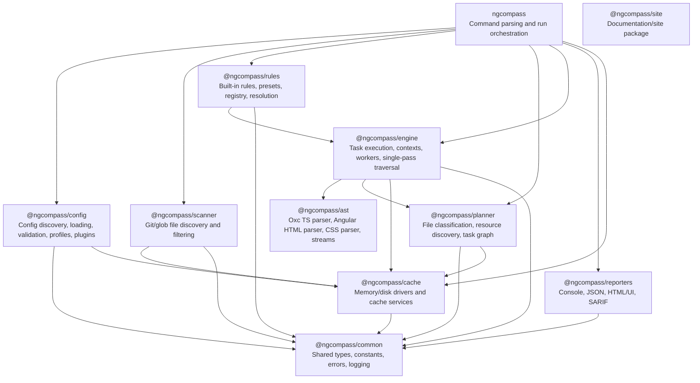

### Package Responsibilities

| Package                | Primary Responsibility                                         | Key Artifacts                                                         |
| ---------------------- | -------------------------------------------------------------- | --------------------------------------------------------------------- |
| `ngcompass`            | User-facing command line orchestration                         | `ngcompass analyze`, `init`, `config`, `cache`, `rules`               |
| `@ngcompass/config`    | Discover, load, normalize, validate, and profile configuration | `resolveConfig`, config health checks, plugin loader                  |
| `@ngcompass/scanner`   | Discover source files from Git or glob patterns                | `scan`, git discovery, filters, stats                                 |
| `@ngcompass/rules`     | Built-in rules, presets, rule registry, rule resolution        | `registerAllBuiltinRules`, `resolveRules`, presets                    |
| `@ngcompass/planner`   | Convert files plus rules into executable tasks                 | `buildExecutionPlan`, task IDs, resource graph, indexes               |
| `@ngcompass/engine`    | Execute tasks and aggregate results                            | `runAnalysis`, `executeBatchedTasks`, worker pool, type-aware context |
| `@ngcompass/ast`       | Parse and traverse source artifacts                            | Oxc TypeScript AST, Angular HTML AST, CSS parser, node streams        |
| `@ngcompass/cache`     | Provide durable and memory caches                              | config, file, plan, result, analysis, AST, metadata caches            |
| `@ngcompass/reporters` | Render results for humans and machines                         | console, JSON, SARIF, HTML/UI reporters                               |
| `@ngcompass/common`    | Shared domain model and utilities                              | `AnalyzerConfig`, `RuleResult`, `RuleContext`, `ProjectContext`       |

### Internal Package Layout

Each package has one public interface at `src/index.ts`. Its implementation is organized by capability instead of generic technical roles: for example, `engine` contains `execution`, `context`, `project-graph`, and `analysis`; `planner` contains `plan-building`, `task-identity`, `resource-discovery`, and `incremental-analysis`.

```text
packages/<name>/src/
├── index.ts
├── <capability>/
│   └── <implementation>.ts
└── models/
    └── <shared-domain-type>.ts
```

Capability folders are introduced only when multiple files share a responsibility. Package-local types stay with their capability; `models/` contains only types shared across capabilities. Generic catch-all folders such as `utils`, `helpers`, `shared`, and `services` are not used for new code.

## 4. End-to-End Analysis Lifecycle

The `analyze` command is the primary workflow. It starts in `ngcompass` (CLI), then delegates to each subsystem in a strict sequence.

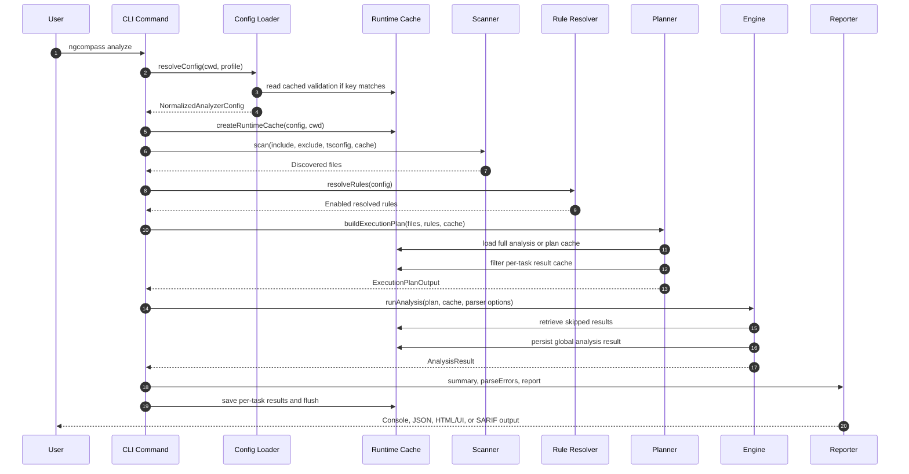

The lifecycle is implemented in `packages/cli/src/commands/analyze/index.ts` as these conceptual stages:

1. Load configuration and plugins.
2. Discover files.
3. Resolve enabled rules.
4. Build an execution plan.
5. Run analysis.
6. Emit reports.
7. Save and flush caches.
8. Decide process exit code from configured failure policy.

## 5. CLI Startup and Command Orchestration

The binary entry point is `packages/cli/src/bin/ngcompass.ts`. Startup performs the following:

1. Creates a Commander program named `ngcompass`.
2. Registers global options: `-V, --version` and `--debug`.
3. Creates an initial cache context via `createCacheContext()`.
4. Registers signal and exception handlers (SIGINT, SIGTERM, uncaughtException, unhandledRejection).
5. Registers built-in rules into the global rule registry.
6. Registers CLI commands.
7. Parses the command line.
8. Flushes cache before normal exit.

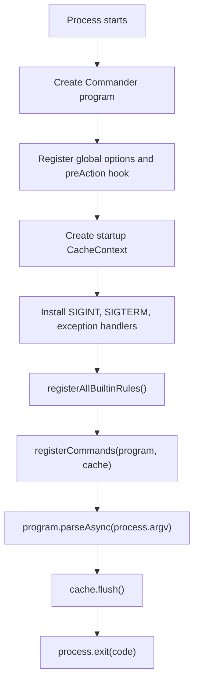

The CLI separates presentation from execution. It instantiates reporters early, but the analysis pipeline produces domain objects such as `ExecutionPlanOutput`, `AnalysisResult`, `RuleResult`, and `ParseError`. Reporters receive those objects after execution and transform them into the selected output format.

### 5.1 Command Flag Reference

**`analyze`** — run static analysis.

| Flag                   | Description                                                                    |
| ---------------------- | ------------------------------------------------------------------------------ |
| `-p, --profile <name>` | Configuration profile to run                                                   |
| `--force`              | Ignore cached results and re-run all checks                                    |
| `--format <fmt>`       | Reporter format: `console` \| `json` \| `sarif` \| `html` \| `ui`              |
| `--compact`            | Use compact, ESLint-style output (console format only)                         |
| `-q, --quiet`          | Show summary counts only, suppress violation details                           |
| `--no-recommendation`  | Suppress fix recommendations from output                                       |
| `--output <path>`      | Output path for HTML reports (default: `ngcompass-report.html`)                |
| `--rule <id>`          | Run only one rule — useful for debugging or focused checks                     |
| `--max-workers <n>`    | Cap the number of worker threads (lower = less memory, e.g. `--max-workers 2`) |
| `--skip-type-check`    | Skip rules that require the TypeScript type checker (fastest, lowest memory)   |

See Section 11 for type-aware execution semantics.

**`init`** — create a starter configuration.

| Flag           | Description                                                                          |
| -------------- | ------------------------------------------------------------------------------------ |
| `-f, --force`  | Overwrite an existing configuration file                                             |
| `--cwd <path>` | Project directory where the configuration will be created (default: `process.cwd()`) |

**`config health`** — validate the active configuration.

| Flag                   | Description                       |
| ---------------------- | --------------------------------- |
| `-p, --profile <name>` | Configuration profile to validate |

**`cache clear`** — clear cached data.

| Flag                   | Description                                                                   |
| ---------------------- | ----------------------------------------------------------------------------- |
| `-p, --profile <name>` | Configuration profile used to resolve cache settings                          |
| `--type <type>`        | Cache type to clear: `ast` \| `config` \| `results` \| `all` (default: `all`) |

**`cache info`** and **`cache path`** both accept `-p, --profile <name>` to resolve profile-specific cache settings.

**`rules [ruleName]`** — browse or inspect rules.

| Flag              | Description                                                                           |
| ----------------- | ------------------------------------------------------------------------------------- |
| `--preset <name>` | Filter by preset: `recommended` \| `strict` \| `performance` \| `reactivity` \| `all` |

**`complexity`** — report cyclomatic and cognitive complexity per function, grouped by file.

This command bypasses the rule pipeline. It reuses configuration loading and file discovery, parses each source file with the Oxc parser, scores every function/method (class methods, accessors, constructors, function declarations/expressions, and arrows) for both cyclomatic and cognitive complexity, then emits a JSON report whose files are ordered worst-first with their functions ranked inside each file.

| Flag                   | Description                                                                |
| ---------------------- | -------------------------------------------------------------------------- |
| `-p, --profile <name>` | Configuration profile to run                                               |
| `--force`              | Ignore cached results and re-run all checks                                |
| `--min <n>`            | Only include functions whose worst metric is at least `n` (default: `0`)   |
| `--sort <metric>`      | Ranking metric: `cyclomatic` \| `cognitive` (default: `cognitive`)         |
| `--output <path>`      | Output path for the JSON file (default: `ngcompass-complexity.json`)       |
| `--stdout`             | Write JSON to stdout instead of a file                                     |

**`callgraph <file>`** — build an intra-file call graph for a single source file.

This command also bypasses the rule pipeline and operates on one explicit file (no configuration loading, file discovery, or cache). It parses the file with the Oxc parser, collects every function/method as a node, then attributes each call site to its innermost enclosing function and resolves the callee by name (`foo()`, `this.foo()`, `obj.foo()`) to a definition in the same file. Calls that resolve to multiple same-named definitions are emitted as `ambiguous` edges; calls to imported or undefined symbols are listed as external calls. Resolution is syntax-only — no type checker and no cross-file resolution.

| Flag              | Description                                                          |
| ----------------- | ------------------------------------------------------------------- |
| `--output <path>` | Output path for the JSON file (default: `ngcompass-callgraph.json`) |
| `--stdout`        | Write JSON to stdout instead of a file                              |

## 6. Configuration Architecture

Configuration is handled by `@ngcompass/config`. Its public entry point is `resolveConfig`.

### 6.1 Discovery

Configuration discovery uses `lilconfig` and searches for:

- `ngcompass.config.ts`
- `ngcompass.config.js`
- `ngcompass.config.mjs`
- `ngcompass.config.cjs`
- `ngcompass.config.json`
- `.ngcompassrc`
- `.ngcompassrc.json`
- `package.json`

TypeScript and JavaScript config files are loaded through `jiti`. JSON and extensionless files are parsed as JSON. The discovery step also reads the raw file content and computes a SHA-1 content hash for validation cache keys.

### 6.2 Resolution and Validation

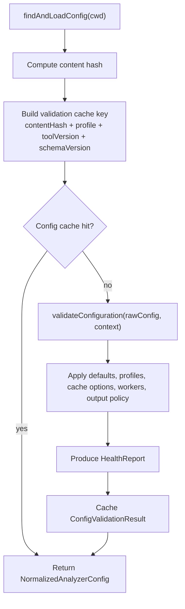

The normalized configuration guarantees stable runtime fields:

- `cache` is always a full object, not a boolean.
- `maxWorkers` has a concrete numeric value.
- `outputFormat`, `failOnSeverity`, and `maxWarnings` are resolved.
- `rules` is always present.

Default cache behavior is enabled, local, and stored at `node_modules/.cache/ngcompass` with a 24-hour TTL. Default worker count is based on host CPU count minus one, capped at four workers by default, with a minimum of one. Users can still opt into more parallelism with `maxWorkers`.

### 6.3 Plugin Loading

When `config.plugins` is present, the CLI calls `loadPlugins(pluginList, configDir, getGlobalRegistry())`. Plugins register `RulePlugin` objects into the same `RuleRegistry` used by built-in rules. This keeps the engine independent from whether a rule is built in or external.

## 7. Scanner Architecture

The scanner converts configuration patterns into an absolute file list. It is optimized for large Git repositories but falls back to glob discovery when needed.

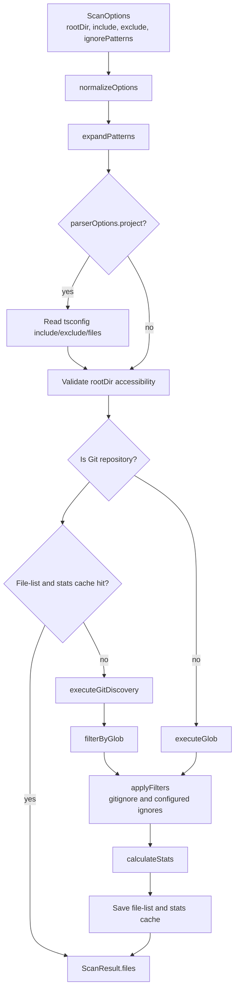

The scanner cache stores the discovered file list plus scan statistics such as
extension counts and total size. On a cache hit it reuses those statistics
instead of restatting every file.

The scanner cache key includes:

- Normalized root directory.
- Expanded include and ignore patterns.
- Git repository fingerprint or directory fingerprint.
- Scanner cache version.

This means changes in tracked files, discovery patterns, or repository state invalidate the file-list cache.

## 8. Rule System Architecture

Rules are passive observers over pre-filtered node streams. They do not own the traversal. Instead, each rule declares:

- Name.
- Stream type.
- Handler.
- Metadata.
- Dependency type.
- Required analysis resources.

### 8.1 Rule Registry

The `RuleRegistry` is the single source of truth for handlers and metadata. It prevents accidental duplicate registration unless an explicit override option is supplied.

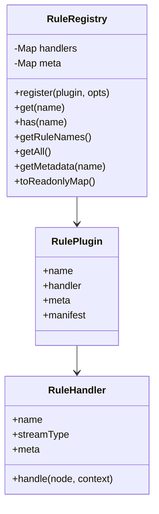

### 8.2 Built-In Rule Domains

Built-in rules are registered in `packages/rules/src/registry/register-all.ts`. The domains are:

| Domain      | Purpose                                                                         |
| ----------- | ------------------------------------------------------------------------------- |
| Correctness | Prevent defects, lifecycle misuse, memory leaks, and reactive side effects      |
| Performance | Avoid rendering bottlenecks and change-detection inefficiencies                 |
| Security    | Detect unsafe bindings and sanitization bypasses                                |
| SSR         | Detect browser-only API usage and render lifecycle risks                        |
| Reactivity  | Enforce RxJS and Angular Signals patterns                                       |
| Modern API  | Encourage Angular 17+ APIs such as `inject`, signal inputs, outputs, and models |
| Template    | Enforce template syntax and async-pipe patterns                                 |
| Testing     | Detect focused tests and similar CI blind spots                                 |

### 8.3 Rule Resolution

Rule resolution combines presets and local configuration:

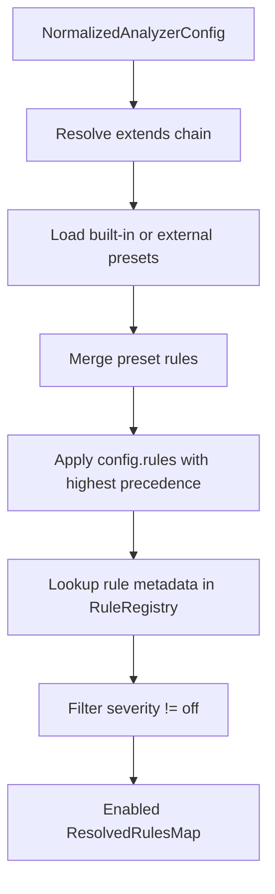

The resolver skips unknown rules rather than crashing resolution. The validation layer can still report configuration issues depending on health checks.

## 9. Planner Architecture

The planner is the architectural center of ngcompass performance. It converts a file list and enabled rules into a set of executable tasks with stable content-addressed identities.

### 9.1 Planner Inputs and Outputs

Inputs:

- Absolute files from the scanner.
- Enabled `ResolvedRulesMap`.
- Project root.
- Runtime cache context.
- Incremental options, such as force rerun.
- Optional worker count and overrides.

Output:

- `tasks`: flat task-centric execution list.
- `plan`: file-centric compatibility view.
- `indexes`: precomputed lookup indexes.
- `skippedTasks`: tasks satisfied by the result cache.
- `cachedResults`: optional preloaded cached results.
- `globalHash`: content hash for the full plan and analysis result.
- `precomputedAnalysis`: full cached `AnalysisResult`, when available.
- `changedFiles` and `cachedFiles`.

### 9.2 Plan Build Flow

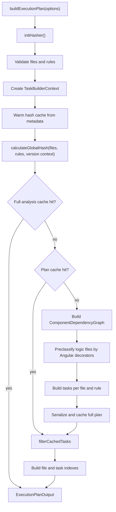

Metadata warmup happens before `globalHash` calculation. On warm runs this lets
the planner rebuild the project hash from file stats plus persisted content
hashes, only re-reading files whose size or modification time changed. On cold
runs it also seeds the metadata cache before task construction so later warm
runs can avoid full-project content reads.

### 9.3 File Classification

The planner classifies files into the following `FileType` values:

- `component`
- `directive`
- `pipe`
- `service`
- `module`
- `guard`
- `logic`
- `angular-class`
- `spec`
- `template`
- `style`
- `config`
- `unknown`

Level-2 classification upgrades plain logic files to `angular-class` when the file content contains Angular decorators. This allows rules that target Angular classes to run on files that do not follow conventional file naming.

### 9.4 Resource Discovery

A rule task may depend on multiple related files:

- Primary TypeScript file.
- External or inline template.
- Style files.
- Spec file.

The planner builds a component dependency graph once per cold plan. The task builder then resolves component resources in O(1). If graph lookup misses, it falls back to directory discovery.

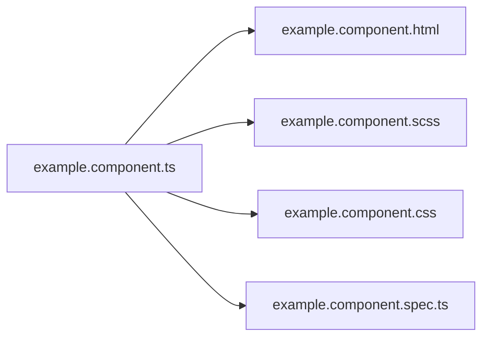

### 9.5 Task Identity

The task is the fundamental execution unit.

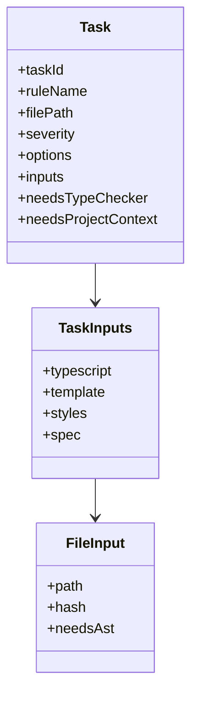

`taskId` is calculated from:

- Rule name.
- Content hashes for all task inputs.
- Rule options.
- Optional cache key context, including tool and rule-set version information.

This makes cache invalidation precise. A template-only change invalidates the tasks that depend on that template. A rule option change invalidates tasks for that rule. A tool or rule registry change can invalidate old task IDs.

### 9.6 Incremental Filtering

After all tasks exist, the planner asks the result cache which `taskId`s already exist.

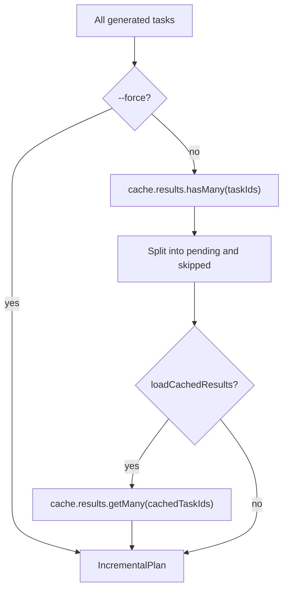

The engine receives only pending tasks as `plan.tasks`, plus `skippedTasks` and optional cached results. This is why warm analysis can avoid AST parsing and rule execution entirely.

## 10. Engine Architecture

The engine executes an `ExecutionPlanOutput` and returns an `AnalysisResult`.

### 10.1 Execution Strategy

The engine splits pending tasks into two groups:

- Syntax-only tasks: do not need TypeScript type checker or project context.
- Type-aware tasks: require a TypeScript `Program`, `TypeChecker`, or `ProjectContext`.

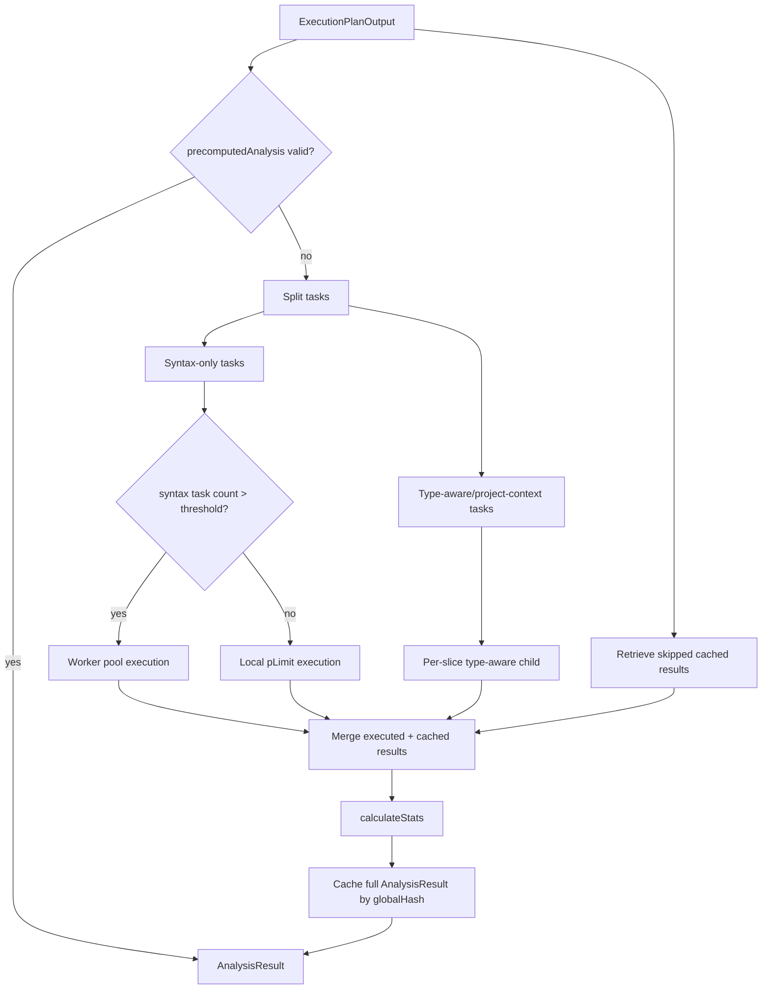

### 10.2 Analysis Context

`AnalysisContext` provides memoized access to file resources:

- `readFile(filePath)`.
- `getProgram(filePath)` for Oxc AST.
- `getTemplate(filePath)` for external or inline Angular template AST.
- `getStyle(filePath)` for CSS-like style AST.
- `evict(filePath)` for memory control.

It uses an LRU cache for file content and maps for parsed artifacts. The engine evicts per-file resources after that file's task batch completes.

### 10.3 Type-Aware Context

`TypeAwareAnalysisContext` extends `AnalysisContext` with:

- `getTypeChecker(filePath)`.
- `getProjectContext()`.
- `getTsSourceFile(filePath)`.
- `warmup()`.

It creates TypeScript `Program`s from `parserOptions.project` or the nearest
`tsconfig.json`, with type-aware root files as program roots. The type-aware
files are partitioned into heap-sized **slices** (`planTypeAwareSlices`, sized by
`resolveMaxFilesPerSlice` from the child's `--max-old-space-size`). The child
builds one `Program` per slice, walks the slice's files against that `Program`'s
checker, then disposes the `Program` and forces garbage collection before
building the next slice. Peak memory is therefore bounded by a single slice
rather than the whole project, which keeps large monorepos under the heap limit
at the cost of re-parsing shared `.d.ts` declarations once per slice. Files are
sorted before slicing so that co-located files (which tend to share an import
closure) land in the same slice.

A small project that fits within one slice is built as a single `Program`, so
there is no slicing overhead in the common case.

Project-context import graph construction uses TypeScript's module-resolution
cache while walking import specifiers, avoiding repeated package/path resolution
work.

The type-aware step runs in one long-lived `child_process.fork`. The `Program`s
live on the child's own heap, so an out-of-memory crash is contained to the
child: the CLI process survives, keeps every `RuleResult` already streamed back,
and reports a clean skip for the unfinished files. Because each slice streams its
results before the next slice is built, an OOM late in the run only affects the
files not yet reached. There is no bisection retry — slicing is the memory bound,
and the streamed-results salvage is the last resort.

The child walks each slice's files one at a time against that slice's
`TypeChecker` and streams `file-result` and `file-progress` messages back as each
file finishes. After every file it evicts that file's content, AST, template, and
style artifacts, and hints garbage collection when heap pressure is high. The
`TypeChecker` is single-threaded, so files are processed sequentially rather than
concurrently.

When the workload contains project-context rules and the project is sliced, a
single whole-project `ProjectContext` is built once (`buildWholeProjectContext`)
from a lightweight `noResolve`/`noLib` `Program` that parses only the project's
own source files — never the `.d.ts` type closure and never the checker — and is
shared, unchanged, across every slice. This keeps cross-file rules as accurate as
a single whole-project build while staying cheap enough to fit in memory. The
import graphs, component graphs, and NgModule maps it produces hold only string
keys, so the lightweight `Program` is released immediately after. Workloads that
only need the `TypeChecker` skip that construction entirely.

If the child cannot be located, the type-aware tasks fall back to running
in-process against an equivalent context.

### 10.4 Rule Context Factory

Before a rule batch executes, `RuleContextFactory` constructs a `RuleContext`:

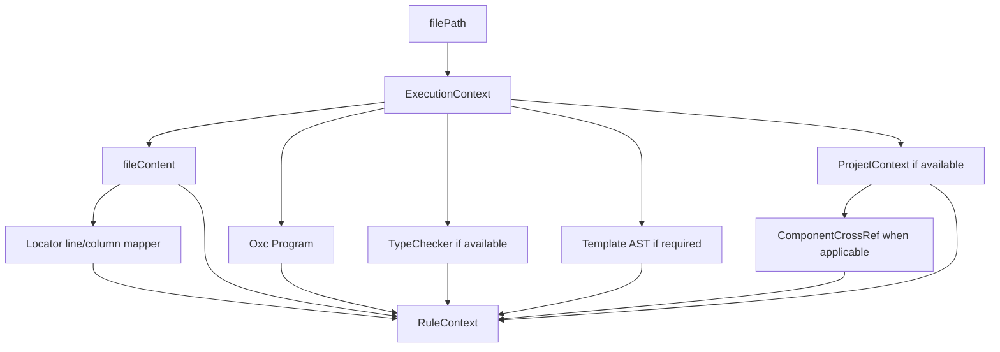

The factory also builds component/template cross references when project context exists. Those cross references include:

- Component path.
- Template path.
- Style paths.
- Spec path.
- Public class members.
- Signal-like members.
- Template references.

## 11. Type-Aware Execution Tuning

Type-aware analysis partitions type-aware root files into heap-sized slices and builds one TypeScript `Program` per slice inside a forked child process, walking each file once, sequentially, against that slice's checker. The type checker is single-threaded and never runs concurrently with itself. Slicing bounds peak memory to a single slice (sized from the child's `--max-old-space-size`), so raising the heap limit both lets each slice hold more files and is the primary lever for type-aware throughput; the syntax worker pool and skipping type-aware work entirely are the other levers.

### 11.1 Tuning Knobs

| Knob                  | Flag                | Default | Effect                                                                                              |
| --------------------- | ------------------- | ------- | --------------------------------------------------------------------------------------------------- |
| Syntax worker threads | `--max-workers <n>` | CPU − 1 | Caps the syntax-only worker pool. Lower values reduce memory for the parallel, non-type-aware path. |
| Skip type checking    | `--skip-type-check` | off     | Skips every rule that needs the TypeScript checker, so no type-aware `Program` is ever built.        |
| Heap limit            | `NODE_OPTIONS=--max-old-space-size=<mb>` | ~4 GB child | Raises the per-slice file budget, so more files fit per slice and fewer slices are built. |

`--max-workers` only affects the syntax-only pool; type-aware files are always walked one at a time within a slice, so this flag does not change type-aware memory or speed.

### 11.2 Priority Chain

```
explicit CLI flag  >  config value  >  engine default
```

`--max-workers` overrides the normalized config `maxWorkers`, which falls back to the engine default of CPU − 1.

### 11.3 Usage

```sh
ngcompass analyze                   # default: syntax pool + per-slice type-aware pass
ngcompass analyze --max-workers 2   # low memory for the syntax worker pool
ngcompass analyze -p strict         # run with a named profile
ngcompass analyze --skip-type-check # syntax-only, fastest, lowest memory
```

## 12. Single-Pass Analysis Engine

The single-pass engine is the high-throughput path for rule execution. It appears in `packages/engine/src/execution/single-pass-engine.ts`.

Rules declare a `streamType`, such as:

- `AngularClass`
- `AnyAngularClass`
- `DecoratedProperty`
- `TemplateExpression`
- `TemplateAttribute`
- `TemplateBlock`
- `Template`
- `CallExpression`
- `NewExpression`

The engine builds a visitor map from stream type to Oxc AST node type:

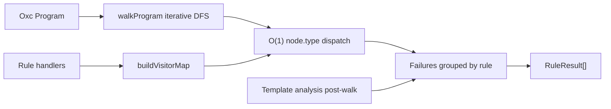

### 11.1 AST Traversal

The AST traversal is iterative pre-order DFS. It avoids recursive call-stack risk and avoids `Object.keys()` allocations on every node. Non-child fields such as `parent`, `span`, `loc`, `range`, `start`, `end`, and `type` are skipped.

### 11.2 Visitor Dispatch

For each AST node:

1. The engine reads `node.type`.
2. It looks up registered visitor entries for that node type.
3. Each entry filters the raw node into a stream-specific node.
4. Matching stream nodes are passed to the rule handler.
5. Failures are grouped by rule name.

Template streams are dispatched after the TypeScript AST walk. The engine calls `analyzeTemplate(context.template)` and dispatches template expressions, attributes, blocks, and whole-template analysis to template-specific handlers.

### 11.3 Performance Monitoring

The engine records:

- Total traversal time.
- Nodes visited.
- Per-rule timing and invocation count when debug/profiling is enabled.
- Component analyzer cache hits and misses.
- Performance budget violations.

Budgets differ depending on whether a type checker is present.

## 13. Worker Architecture

Worker execution is used for large sets of syntax-only tasks. Type-aware tasks remain on the main thread because they need a shared TypeScript `Program` and project context.

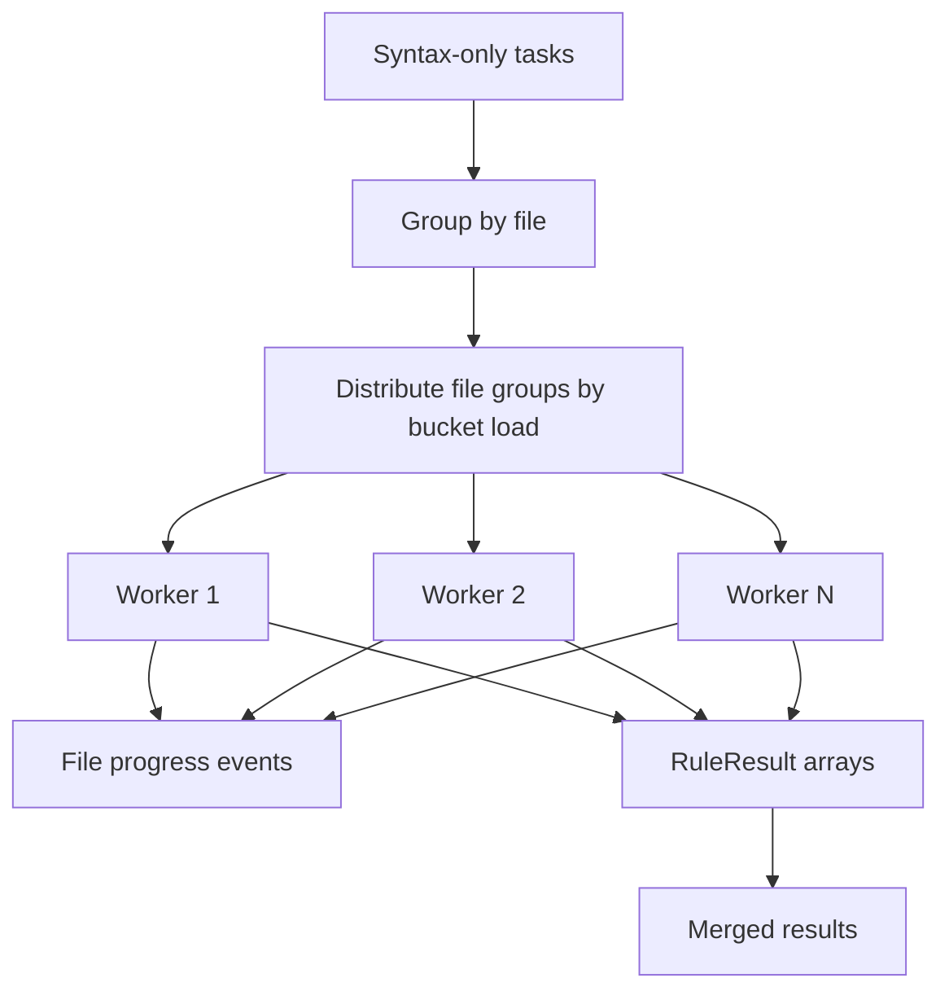

Workers are resolved from the `@ngcompass/rules/execution-worker` package path when possible. If worker resolution fails, the engine falls back to local concurrent execution using `p-limit`.

The worker distribution algorithm keeps all tasks for the same file together. This prevents duplicate parsing and makes progress reporting file-oriented.

## 14. AST and Parsing Architecture

`@ngcompass/ast` provides parsing, node streams, template analysis, and traversal helpers.

| Artifact         | Parser or Analyzer                  | Usage                                            |
| ---------------- | ----------------------------------- | ------------------------------------------------ |
| TypeScript/TSX   | `oxc-parser`                        | Fast syntax AST for rule streams                 |
| Angular HTML     | `angular-html-parser`               | Template expressions, attributes, blocks         |
| CSS-like styles  | CSS parser wrapper                  | Style-oriented rules                             |
| Inline templates | Template extractor from Oxc program | Maps inline template offsets to source locations |
| AST traversal    | Iterative DFS walker                | Single-pass engine traversal                     |

The Angular HTML parser is configured with Angular block tokenization enabled. Template ASTs preserve `templateStartOffset`, so inline-template diagnostics can be mapped back to the correct line and column in the TypeScript file.

## 15. Cache Architecture

The cache package provides multiple services over memory and disk drivers. Runtime cache is created from normalized config through `createRuntimeCache`.

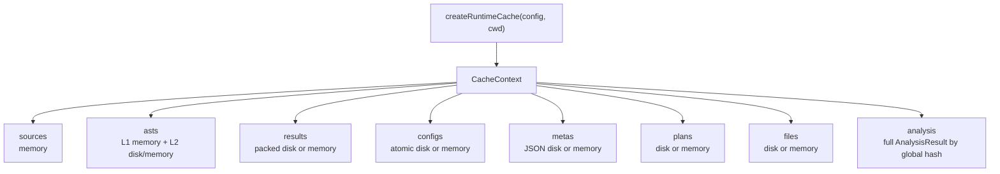

### 14.1 Cache Services

| Cache Service  | Key                     | Value                                    | Main Consumer                               |
| -------------- | ----------------------- | ---------------------------------------- | ------------------------------------------- |
| Config cache   | Config hash             | `ConfigValidationResult`                 | Config loader                               |
| File cache     | Scan key                | Discovered file list and scan statistics | Scanner                                     |
| Plan cache     | Global hash             | Serialized full execution plan           | Planner                                     |
| Result cache   | Task ID                 | `RuleResult`                             | Planner and engine                          |
| Analysis cache | Global hash             | Full `AnalysisResult`                    | Planner and engine                          |
| AST cache      | Content hash            | Parsed AST entry                         | Config enrichment and parser-adjacent flows |
| Meta cache     | File path/hash metadata | Hash warmup metadata                     | Planner                                     |
| Source cache   | File content            | In-memory source entries                 | Cache subsystem consumers                   |

### 14.2 Cache Layers and Fast Paths

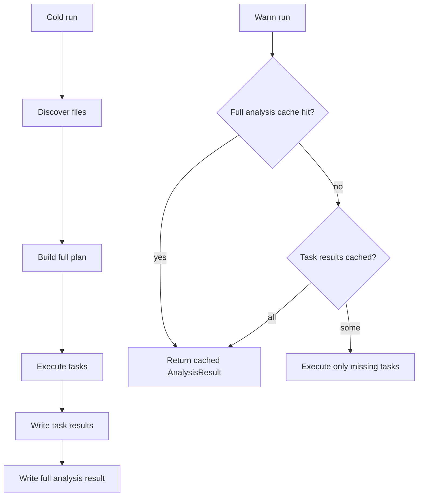

The fastest warm path is a full analysis cache hit by `globalHash`. In that case the planner returns an `ExecutionPlanOutput` with `precomputedAnalysis`, and the engine validates and returns it without parsing or rule execution.

If the full analysis cache is unavailable but per-task result cache entries exist, the planner filters cached tasks out and the engine retrieves cached `RuleResult`s.

### 14.3 Result Cache Write-Behind

The result cache buffers writes in memory during analysis. `setMany` records pending results, and `flush` drains them to disk. When the underlying driver supports bulk writes, all buffered results and metadata can be written in one batch. This reduces I/O overhead on large projects.

## 16. Reporting Architecture

Reporters are selected by CLI option or config output format.

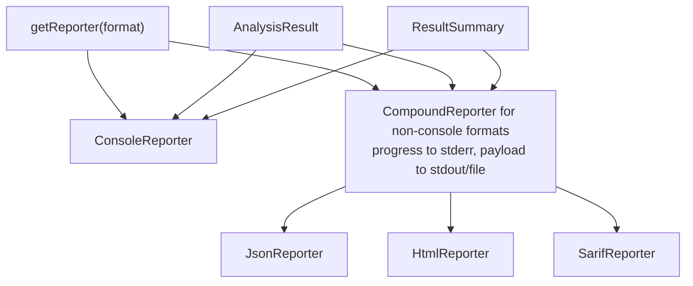

For JSON, SARIF, and HTML/UI output, a `CompoundReporter` emits progress to stderr and sends structured output to the underlying reporter. This prevents progress text from corrupting machine-readable stdout.

`ResultSummary` includes:

- Scanned files.
- Discovered files.
- Files with violations.
- Total tasks.
- Cached tasks.
- Error and warning counts.
- Failure policy.
- Duration.

The CLI decides the final exit code using:

- Any error count greater than zero.
- `failOnSeverity: "warn"` with warnings.
- Warning count greater than `maxWarnings`.

## 17. Data Model Overview

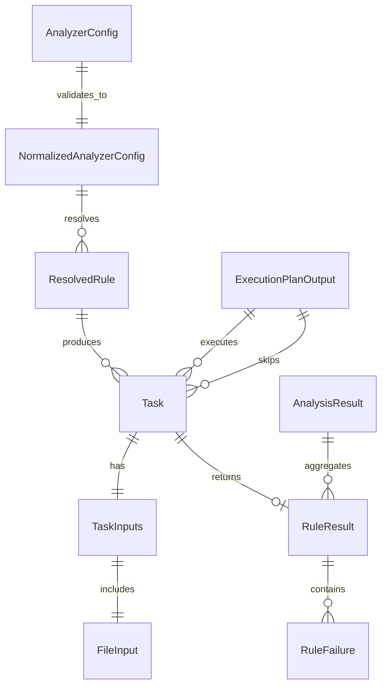

### Principal Domain Types

| Type                       | Package | Description                                 |
| -------------------------- | ------- | ------------------------------------------- |
| `AnalyzerConfig`           | common  | User-authored configuration shape           |
| `NormalizedAnalyzerConfig` | common  | Runtime-safe validated config               |
| `ResolvedRule`             | common  | Rule config plus metadata                   |
| `Task`                     | planner | Content-addressed unit of work              |
| `ExecutionPlanOutput`      | planner | Full planner result for engine              |
| `RuleContext`              | common  | Resources passed to rule handlers           |
| `RuleResult`               | common  | Result for one rule execution               |
| `RuleFailure`              | common  | One diagnostic finding                      |
| `AnalysisResult`           | common  | Final aggregate output                      |
| `ProjectContext`           | common  | Cross-file metadata for project-aware rules |

## 18. Project Context and Cross-File Analysis

Project context is constructed only for type-aware or project-context rules. It contains:

- Forward import graph.
- Reverse import graph.
- Angular module metadata.
- Standalone component set.
- Class-to-file map.
- Component file graph.
- Project file set.
- Barrel files.
- External dependency map.
- Template-to-component map.

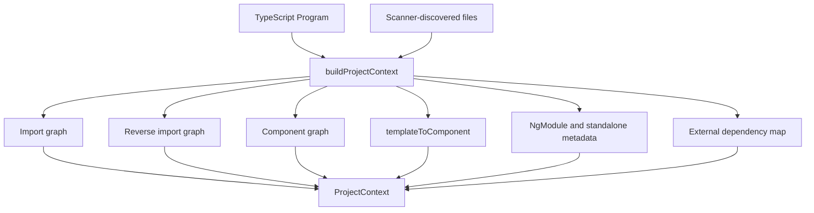

This enables rules to reason about architectural relationships without doing their own project-wide scanning.

## 19. Error Handling and Resilience

ngcompass uses explicit result objects and infrastructure error collection where possible.

Key resilience paths:

- Config validation returns a structured health report.
- Scanner returns `Result<ScanResult>`.
- Planner returns `Result<ExecutionPlanOutput>`.
- Engine returns `Result<AnalysisResult>`.
- Cache deserialization failure is treated as recoverable; the corrupted plan entry is deleted and rebuilt.
- Worker failure terminates remaining workers and propagates a recoverable infrastructure error path.
- Rule execution failures are recorded and isolated so one rule does not necessarily stop the entire file batch.
- Reporters receive parse errors separately from rule failures.

```mermaid
flowchart TD
    Failure["Operational failure"]
    Config["Config issue"]
    Scan["Scan error"]
    Cache["Cache corruption"]
    Rule["Rule execution error"]
    Worker["Worker crash or timeout"]
    Report["Reporter error output"]
    Recover["Recover or continue when safe"]
    Exit["Non-zero exit when required"]

    Failure --> Config --> Report --> Exit
    Failure --> Scan --> Report --> Exit
    Failure --> Cache --> Recover
    Failure --> Rule --> Recover
    Failure --> Worker --> Recover
    Recover --> Report
```

## 20. Performance Model

The performance model is based on reducing repeated work at every layer.

| Layer       | Optimization                                                                           |
| ----------- | -------------------------------------------------------------------------------------- |
| Config      | Content-hash validation cache                                                          |
| Scanner     | Git discovery and file-list cache                                                      |
| Planner     | Global hash, plan cache, component graph, hash warmup                                  |
| Incremental | `taskId` result-cache filtering                                                        |
| Engine      | Single-pass AST traversal and batched rule execution                                   |
| Workers     | Parallel syntax-only execution by file group                                           |
| Type-aware  | Heap-sized per-slice TypeScript Programs in an isolated forked child, one shared project-context index |
| Cache I/O   | Packed result cache and write-behind flush                                             |
| Context     | LRU file content, memoized ASTs, explicit eviction                                     |

### Cold Run

On a cold run, ngcompass performs the full pipeline:

1. Load and validate config.
2. Discover files.
3. Resolve rules.
4. Build component graph.
5. Hash resources.
6. Generate tasks.
7. Parse and analyze files.
8. Persist per-task and full-analysis caches.

### Warm Run

On a warm run, ngcompass can short-circuit at multiple levels:

1. Config validation cache.
2. Scanner file-list cache.
3. Full analysis cache by global hash.
4. Plan cache by global hash.
5. Result cache by task ID.

The warm path can therefore avoid AST parsing and rule execution entirely when no relevant inputs changed.

## 21. Extensibility Model

### 20.1 Adding a Rule

A new rule typically uses a helper from `@ngcompass/engine`, such as:

- `createComponentRule`
- `createAnyAngularClassRule`
- `createDecoratedPropertyRule`
- `createTemplateExpressionRule`
- `createTemplateAttributeRule`
- `createTemplateBlockRule`
- `createTemplateRule`
- `createCallExpressionRule`
- `createNewExpressionRule`

The rule supplies a stream handler and metadata. Metadata declares dependency type and resource requirements. The planner uses that metadata to decide which files the rule applies to and what resources must be available.

```mermaid
flowchart TD
    Rule["RuleHandler"]
    Meta["RuleMetadata<br/>dependencyType + requires"]
    Register["RuleRegistry.register"]
    Resolve["resolveRules"]
    Plan["Planner creates matching tasks"]
    Execute["Engine dispatches stream nodes"]
    Result["RuleResult"]

    Rule --> Register
    Meta --> Register
    Register --> Resolve --> Plan --> Execute --> Result
```

### 20.2 Adding a Reporter

A reporter implements the reporter contracts in `@ngcompass/reporters`:

- `report(results)`.
- `summary(stats)`.
- `parseErrors(errors)`.
- `error(error)`.
- Progress methods such as `step`, `info`, and `debug`.

The reporter is then added to `getReporter(format)`.

### 20.3 Adding a Cache Strategy

The cache system is driver-oriented. A new storage backend should implement the async driver contract and then be wired into `createCacheContext`. Services such as `ResultCache`, `PlanCache`, and `FileCache` should remain stable and consume the driver abstraction.

## 22. Deployment and Runtime Layout

The CLI is built from `packages/cli/src/bin/ngcompass.ts` into `packages/cli/dist/cli.js` and `cli.cjs`. The package build uses `tsup`. At runtime, the CLI loads other workspace packages from their built `dist` outputs according to package exports and Node module resolution.

Runtime project cache is stored under the analyzed project's configured cache location, usually:

```text
node_modules/.cache/ngcompass
```

Typical subdirectories include:

```text
analysis/
ast/
config/
files/
meta/
plans/
results/
```

## 23. Complete Analysis Pipeline Diagram

```mermaid
flowchart TD
    A["User runs ngcompass analyze"]
    B["CLI initializes reporter and cache"]
    C["Config discovery via lilconfig/jiti"]
    D["Config validation and normalization"]
    E["Runtime cache from normalized config"]
    F["File discovery via Git or glob"]
    G["Rule resolution from presets and config"]
    H["Planner global hash"]
    I{"Full analysis cached?"}
    J["Return cached AnalysisResult"]
    K{"Plan cached?"}
    L["Build component graph and tasks"]
    M["Filter tasks by result cache"]
    N{"Pending tasks?"}
    O["Retrieve cached RuleResult entries"]
    P["Split pending tasks by execution capability"]
    Q["Syntax-only workers or local batches"]
    R["Type-aware per-slice forked child"]
    S["RuleContextFactory builds RuleContext"]
    T["Single-pass engine dispatches rule handlers"]
    U["Merge executed and cached results"]
    V["Compute stats and failure status"]
    W["Persist result and analysis caches"]
    X["Reporter emits console/json/html/sarif"]
    Y["CLI exits according to fail policy"]

    A --> B --> C --> D --> E --> F --> G --> H --> I
    I -- yes --> J --> X --> Y
    I -- no --> K
    K -- yes --> M
    K -- no --> L --> M
    M --> N
    N -- no --> O --> U
    N -- yes --> P
    P --> Q --> S
    P --> R --> S
    S --> T --> U
    O --> U
    U --> V --> W --> X --> Y
```

## 24. Summary

ngcompass is structured as a layered analysis platform. The CLI coordinates execution, but the architecture keeps discovery, configuration, planning, execution, caching, rules, AST parsing, and reporting independently testable. The most important internal abstraction is the task: a content-addressed rule execution unit that connects file/resource hashing, incremental caching, planner indexes, worker execution, and final reporting.

The result is a tool that can behave like a full Angular static analyzer on cold runs while returning warm cached results quickly when the project state has not changed.
