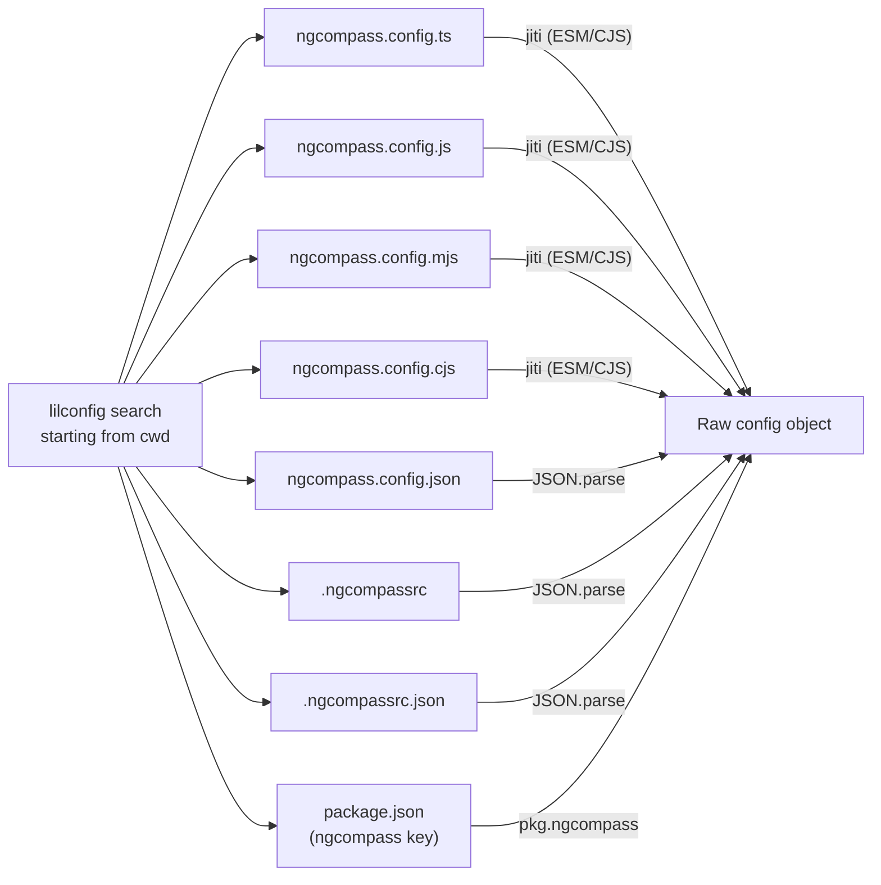
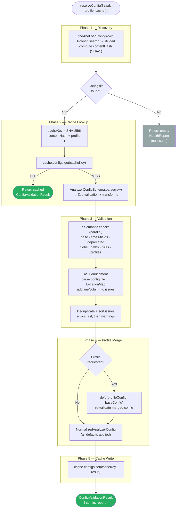
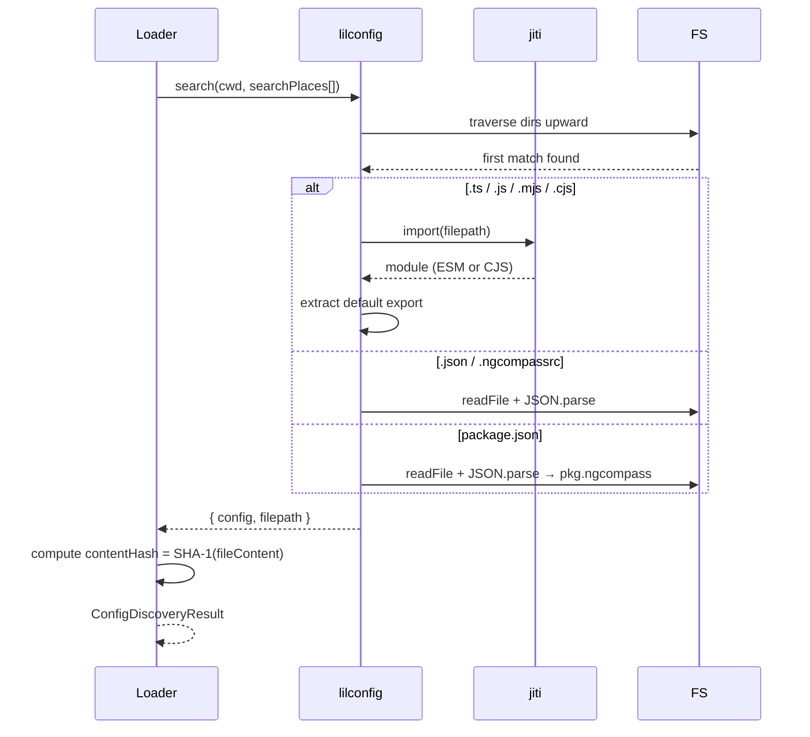
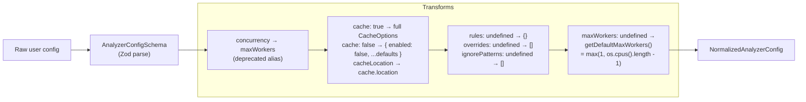
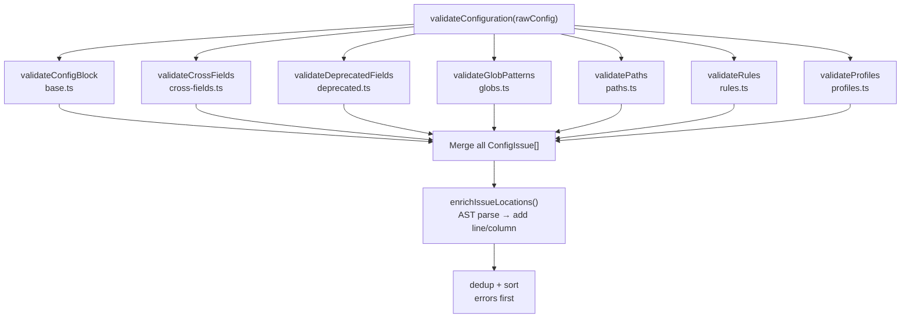
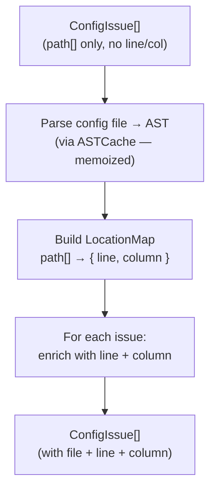
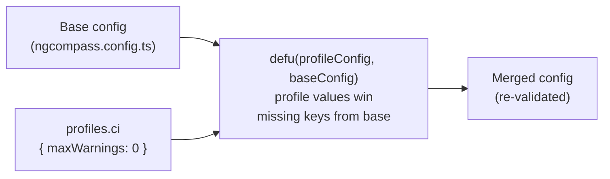
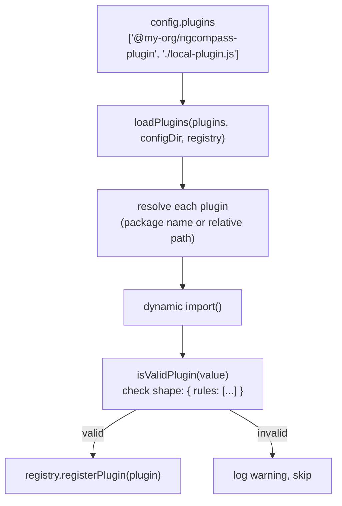
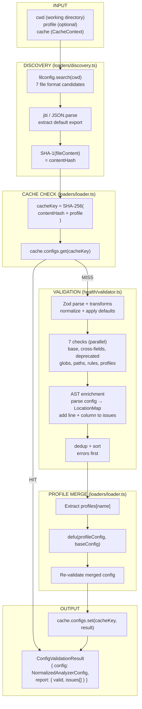
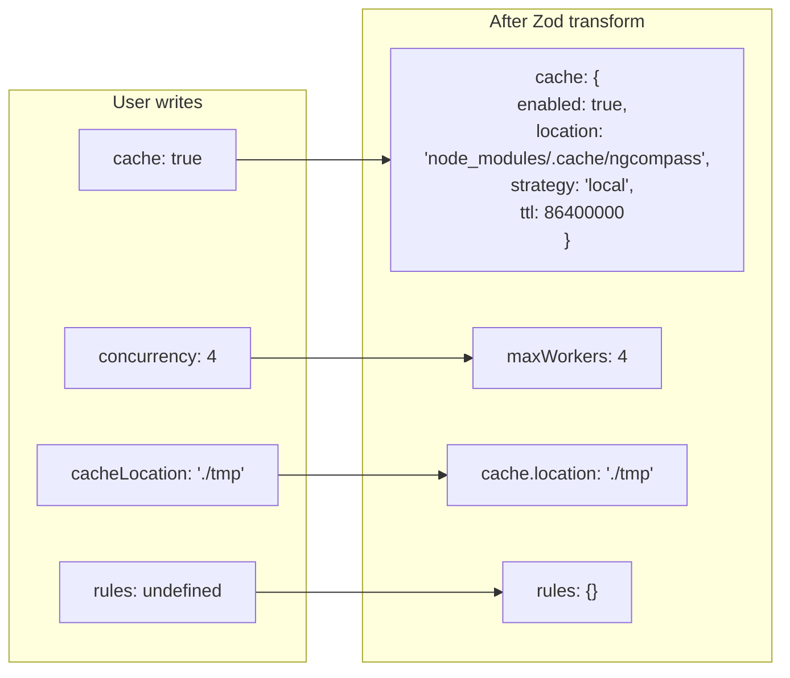

# Config Architecture — ngcompass (core package)

> Deep-dive documentation of the configuration system — covering discovery, loading, schema validation, normalization, health checks, caching, profiles, plugins, and integration with the planner and engine.

---

## Table of Contents

1. [Overview](#1-overview)
2. [File Tree](#2-file-tree)
3. [Type Definitions](#3-type-definitions)
4. [Config File Formats](#4-config-file-formats)
5. [Full Config Lifecycle](#5-full-config-lifecycle)
6. [Discovery](#6-discovery)
7. [Schema & Normalization](#7-schema--normalization)
8. [Health Checks](#8-health-checks)
9. [AST Location Enrichment](#9-ast-location-enrichment)
10. [Profiles](#10-profiles)
11. [Plugins](#11-plugins)
12. [Config Cache](#12-config-cache)
13. [Default Values](#13-default-values)
14. [Error Catalog](#14-error-catalog)
15. [Integration Points](#15-integration-points)
16. [Function Reference](#16-function-reference)
17. [Data Flow Diagrams](#17-data-flow-diagrams)

---

## 1. Overview

The config system is a **multi-layered pipeline** that takes a raw user-authored config file and produces a fully validated, normalized, and cached `NormalizedAnalyzerConfig`. It is the first stage of every analysis run.

### Design Principles

| Principle | Implementation |
|---|---|
| **Zero required fields** | All config options have defaults; an empty `{}` is valid |
| **Content-addressable caching** | Config cached by hash of file content + profile name |
| **Precise error locations** | Issues enriched with exact line/column via AST parsing |
| **Semantic validation** | 7 independent check modules beyond schema |
| **Profile support** | Environment-specific overrides (dev, ci, prod, etc.) |
| **Pluggable rules** | External plugins loaded by package name or path |

---

## 2. File Tree

```
packages/
│
├── common/src/
│   ├── constants.ts          ← Tool name, default patterns, cache dir
│   ├── errors.ts             ← ConfigExistsError and other error classes
│   ├── interfaces.ts         ← AnalyzerConfig, RuleConfig, ConfigIssue, etc.
│   ├── types.ts              ← Severity, RuleCategory, Result<T>
│   ├── utils.ts              ← Position, Range utilities
│   └── index.ts              ← Public exports
│
└── core/src/
    │
    ├── config/
    │   ├── index.ts           ← Config package public API
    │   │
    │   ├── schemas/
    │   │   ├── schema.ts      ← Zod schema + normalization transforms
    │   │   └── defaults.ts    ← All default values + getDefaultMaxWorkers()
    │   │
    │   ├── loaders/
    │   │   ├── discovery.ts   ← Config file discovery (lilconfig + jiti)
    │   │   └── loader.ts      ← Resolution, profile merging, cache integration
    │   │
    │   ├── health/
    │   │   ├── index.ts       ← Health sub-package exports
    │   │   ├── validator.ts   ← Main validation orchestrator
    │   │   ├── context.ts     ← ValidationContext factory
    │   │   ├── enricher.ts    ← AST-based line/column enrichment
    │   │   ├── types.ts       ← Internal validation types
    │   │   ├── messages.ts    ← Error/warning message templates (30+ codes)
    │   │   ├── constants.ts   ← Valid severity strings + numeric levels
    │   │   └── checks/
    │   │       ├── index.ts       ← Check exports
    │   │       ├── base.ts        ← Base config block (autoFix, workers, debounce, TTL)
    │   │       ├── cross-fields.ts ← Cross-field rules (maxWarnings, etc.)
    │   │       ├── deprecated.ts  ← Deprecated field warnings
    │   │       ├── globs.ts       ← Glob pattern validation
    │   │       ├── paths.ts       ← Path existence + permissions
    │   │       ├── rules.ts       ← Rule config validation
    │   │       └── profiles.ts    ← Profile validation + circular detection
    │   │
    │   ├── actions/
    │   │   ├── init.ts        ← `compass config init` — generate config template
    │   │   └── healthcheck.ts ← `compass config health` — validate and report
    │   │
    │   └── plugin-loader.ts   ← External plugin loading + validation
    │
    └── cache/services/
        └── config-cache.ts    ← Config-specific cache service (get/set by hash)
```

---

## 3. Type Definitions

### 3.1 Main Config Interface

```typescript
// packages/common/src/interfaces.ts

interface AnalyzerConfig {
    // Inheritance
    extends?: string | string[];

    // File targeting
    include?:         string[];
    exclude?:         string[];
    ignorePatterns?:  string[];

    // Execution
    maxWorkers?:      number;
    concurrency?:     number;           // Deprecated → maxWorkers

    // Caching
    cache?:           boolean | CacheOptions;
    cacheLocation?:   string;           // Deprecated → cache.location

    // Watch mode
    watch?:           boolean;
    watchOptions?:    WatchOptions;

    // Auto-fix
    autoFix?:         boolean;
    autoFixOnSave?:   boolean;

    // Reporting
    outputFormat?:    OutputFormat;
    outputPath?:      string;
    failOnSeverity?:  FailSeverity;
    maxWarnings?:     number;
    reportUnusedDisableDirectives?: boolean;

    // Plugins
    plugins?:         string[];

    // Rules
    rules?:           Record<string, RuleConfig | Severity | 'off'>;

    // Overrides (file-pattern rules)
    overrides?:       ConfigOverride[];

    // TypeScript parser
    parserOptions?:   ParserOptions;

    // Environment profiles
    profiles?:        Record<string, ProfileConfig>;
}
```

### 3.2 Supporting Interfaces

```typescript
interface RuleConfig {
    severity: Severity | 'off';
    options?: Record<string, unknown>;
}

interface CacheOptions {
    enabled?:   boolean;
    location?:  string;
    strategy?:  'memory' | 'local';
    ttl?:       number;                 // ms
}

interface WatchOptions {
    debounce?:  number;
    ignored?:   string[];
}

interface ConfigOverride {
    files:   string | string[];
    rules?:  Record<string, RuleConfig | Severity | 'off'>;
}

interface ParserOptions {
    project?:          string;          // path to tsconfig
    tsconfigRootDir?:  string;
    sourceType?:       'module' | 'commonjs';
    ecmaVersion?:      number;
}

// ProfileConfig = AnalyzerConfig minus 'profiles' (no nesting)
interface ProfileConfig extends Partial<Omit<AnalyzerConfig, 'profiles'>> {}
```

### 3.3 Normalized Config (post-validation)

```typescript
// All optional fields resolved to concrete values
interface NormalizedAnalyzerConfig extends Omit<AnalyzerConfig,
    'cache' | 'maxWorkers' | 'outputFormat' | 'failOnSeverity' |
    'maxWarnings' | 'reportUnusedDisableDirectives' | 'rules'
> {
    cache:                         Required<CacheOptions>;   // always full object
    maxWorkers:                    number;                   // cpus-1 or 1
    outputFormat:                  OutputFormat;
    failOnSeverity:                FailSeverity;
    maxWarnings:                   number;
    reportUnusedDisableDirectives: boolean;
    rules:                         Record<string, RuleConfig | Severity | 'off'>;
}
```

### 3.4 Validation Output Types

```typescript
interface ConfigIssue {
    code:        string;                    // e.g. 'invalid-glob-pattern'
    message:     string;
    path?:       (string | number)[];       // JSON path to the issue
    severity:    'error' | 'warning';
    file?:       string;                    // config file path
    line?:       number;                    // from AST enrichment
    column?:     number;                    // from AST enrichment
    suggestion?: string;                    // fix hint
}

interface HealthReport {
    valid:    boolean;
    issues:   ConfigIssue[];
    config?:  any;
}

interface ConfigValidationResult {
    config?:  NormalizedAnalyzerConfig;   // only present if valid
    report:   HealthReport;
}
```

### 3.5 Severity System

```typescript
type Severity = 'critical' | 'high' | 'moderate' | 'low' | 'info' | 'warning' | 'error';

// Numeric levels for comparison
const SEVERITY_LEVELS: Record<string, number> = {
    info:     0,
    low:      1,
    warning:  2,
    warn:     2,   // alias
    moderate: 2,   // alias
    high:     3,
    error:    4,
    critical: 4,   // alias
};

// Valid in rule configs
const VALID_RULE_SEVERITIES = [...Object.keys(SEVERITY_LEVELS), 'off'];
```

---

## 4. Config File Formats



### TypeScript Config Example

```typescript
import type { AnalyzerConfig } from '@ngcompass/common';

const config: AnalyzerConfig = {
    include: ['src/**/*.ts'],
    exclude: ['**/*.spec.ts'],
    rules: {
        'no-lifecycle-hooks': { severity: 'high' },
        'use-async-pipe':     'moderate',
    },
    profiles: {
        ci: { failOnSeverity: 'moderate', maxWarnings: 0 },
    },
};

export default config;
```

### Minimal Valid Config

```typescript
export default {};   // all defaults apply — fully valid
```

---

## 5. Full Config Lifecycle



---

## 6. Discovery

### `findAndLoadConfig(cwd)` — `loaders/discovery.ts`



**Returns:**

```typescript
interface ConfigDiscoveryResult {
    config:       unknown;    // raw parsed object
    filepath:     string;     // absolute path
    content:      string;     // raw file content
    contentHash:  string;     // SHA-1 of content
    isEmpty?:     boolean;
}
```

---

## 7. Schema & Normalization

### Zod Schema Transforms (`schemas/schema.ts`)

The schema does two things: **validate** types and **normalize** shorthand values.



### Field-by-Field Normalization

| Raw Value | Normalized To |
|---|---|
| `cache: true` | `{ enabled: true, location: 'node_modules/.cache/ngcompass', strategy: 'local', ttl: 86400000 }` |
| `cache: false` | `{ enabled: false, location: '...', strategy: 'local', ttl: 86400000 }` |
| `cache: { ttl: 0 }` | Merged with defaults: `{ enabled: true, location: '...', strategy: 'local', ttl: 0 }` |
| `cacheLocation: 'x'` | `cache.location = 'x'` (deprecated alias) |
| `concurrency: 4` | `maxWorkers = 4` (deprecated alias) |
| `maxWorkers: undefined` | `max(1, os.cpus().length - 1)` |
| `rules: undefined` | `{}` |
| `overrides: undefined` | `[]` |

---

## 8. Health Checks

Seven independent check modules run in parallel inside `validateConfiguration()`.



### Check 1 — Base Config Block (`checks/base.ts`)

Validates numeric and boolean constraints:

| Rule | Error Code | Condition |
|---|---|---|
| `autoFix` + `autoFixOnSave` mutually exclusive | `mutually-exclusive-autofix` | both `true` |
| `maxWorkers ≥ 1` | `workers-below-minimum` | `< 1` |
| `maxWorkers ≤ cpus × 2` | `warn-workers-excessive` | warning only |
| `watchOptions.debounce ≥ 0` | `negative-debounce` | `< 0` |
| `watchOptions.debounce ≤ 5000` | `warn-debounce-excessive` | warning only |
| `cache.ttl ≥ 0` | `negative-cache-ttl` | `< 0` |
| `cache.ttl === 0` | `warn-cache-ttl-zero` | warning only |

### Check 2 — Cross Fields (`checks/cross-fields.ts`)

| Rule | Error Code | Condition |
|---|---|---|
| `maxWarnings ≥ 0` | `negative-max-warnings` | `< 0` |

### Check 3 — Deprecated Fields (`checks/deprecated.ts`)

| Deprecated Field | Warning Code | Replacement |
|---|---|---|
| `cacheLocation` | `warn-deprecated-cache-location` | `cache.location` |
| `concurrency` | `warn-deprecated-concurrency` | `maxWorkers` |

### Check 4 — Glob Patterns (`checks/globs.ts`)

Validates every string in `include`, `exclude`, and `ignorePatterns`:

| Violation | Error Code |
|---|---|
| Empty string `""` | `empty-glob-pattern` |
| Unclosed bracket `[` | `invalid-glob-pattern` |
| Triple slash `///` | `invalid-glob-pattern` |
| Trailing slash `/` | `invalid-glob-pattern` |
| Unmatched brace `{` | `invalid-glob-pattern` |
| Duplicate pattern | `warn-duplicate-patterns` |
| Empty `include` array | `empty-include` |
| Empty `exclude` array | `warn-empty-exclude` |
| `minimatch` test fails | `invalid-glob-pattern` |

### Check 5 — Paths (`checks/paths.ts`)

| Field | Checks | Error Code |
|---|---|---|
| `outputPath` | No `..` traversal | `output-path-traversal` |
| `outputPath` | Not system dir | `output-path-system-dir` |
| `outputPath` | Parent dir exists | `output-path-not-found` |
| `outputPath` | Dir writable | `output-path-not-writable` |
| `cache.location` | Not in node_modules (except .cache) | `cache-in-node-modules` |
| `cache.location` | Parent dir exists (warning) | `warn-cache-parent-not-found` |
| `parserOptions.project` | File exists | `tsconfig-project-not-found` |
| `parserOptions.tsconfigRootDir` | Dir exists | `tsconfig-root-not-found` |

### Check 6 — Rules (`checks/rules.ts`)

| Rule | Error Code | Condition |
|---|---|---|
| Non-empty rule name | `empty-rule-name` | key is `""` |
| Valid severity value | `invalid-rule-severity` | not in `VALID_RULE_SEVERITIES` |
| Rules exist | `warn-no-rules-configured` | `rules === {}` and no `extends` |

### Check 7 — Profiles (`checks/profiles.ts`)

| Rule | Code | Condition |
|---|---|---|
| Non-empty profiles object | `warn-profile-empty` | `{}` |
| No circular inheritance | `profile-circular-inheritance` | `extends` chain loops |
| HTML output + autoFix in CI | `warn-profile-html-output-ci` | warning |
| All profile blocks pass base check | (delegates to base.ts) | per profile |

---

## 9. AST Location Enrichment

After all checks run, issue paths like `['rules', 'my-rule', 'severity']` are resolved to exact line/column numbers by parsing the config file's AST.



**Result:** Developer sees:

```
ngcompass.config.ts:12:18  error  invalid-rule-severity
  rules.my-rule.severity: "banana" is not a valid severity
  Valid values: off, info, low, moderate, high, error, critical
```

---

## 10. Profiles

Profiles allow environment-specific configuration overrides without maintaining multiple config files.

### Profile Merge Strategy



`defu` is a deep-merge utility where the **first argument wins** — profile values override base values, and anything not in the profile falls back to the base config.

### Profile Validation Rules

1. Profile configs cannot themselves contain `profiles` (no nesting)
2. Circular `extends` chains are detected: `dev → ci → dev` → error
3. Each profile block is independently validated by `validateConfigBlock`
4. Warning issued if CI-like profile uses HTML output + autoFix

### Usage

```bash
compass analyze --profile ci
compass config health --profile dev
```

```typescript
// ngcompass.config.ts
export default {
    rules: { 'use-async-pipe': 'moderate' },
    profiles: {
        dev: {
            maxWarnings: 50,
            outputFormat: 'text',
        },
        ci: {
            failOnSeverity: 'moderate',
            maxWarnings: 0,
            outputFormat: 'json',
        },
    },
};
```

---

## 11. Plugins

External plugins extend the rule registry with third-party or custom rules.

### Loading (`plugin-loader.ts`)



### Plugin Shape

```typescript
interface Plugin {
    name:   string;
    rules:  RuleHandler[];   // array of RuleHandler implementations
}

// Validation
function isValidPlugin(value: unknown): value is Plugin {
    return (
        typeof value === 'object' &&
        value !== null &&
        typeof (value as any).name === 'string' &&
        Array.isArray((value as any).rules)
    );
}
```

---

## 12. Config Cache

### Cache Service (`cache/services/config-cache.ts`)

```typescript
interface ConfigCache {
    get: (hash: string) => Promise<ConfigValidationResult | undefined>;
    set: (hash: string, result: ConfigValidationResult) => Promise<void>;
}
```

**Driver:** Atomic JSON file driver (`{cacheDir}/config/`)

### Cache Key Construction

```
cacheKey = SHA-256( contentHash + "::" + (profile ?? "") )

Where:
  contentHash = SHA-1(raw file content)   ← from discovery
  profile     = selected profile name
```

| Scenario | Cache Behavior |
|---|---|
| Same file, same profile | **HIT** — return cached result |
| File content changed | **MISS** — new contentHash |
| Same file, different profile | **MISS** — different key |
| File moved (same content) | **MISS** — new contentHash (file is re-read) |

### What Is Cached

The complete `ConfigValidationResult`:
```typescript
{
    config?: NormalizedAnalyzerConfig,   // normalized, ready to use
    report: {
        valid:  boolean,
        issues: ConfigIssue[]             // with line + column enrichment
    }
}
```

Caching the enriched result means **AST parsing and all 7 checks are skipped** on warm runs, even if the validation found errors.

---

## 13. Default Values

### `defaults.ts`

```typescript
const DEFAULT_CACHE_OPTIONS: Required<CacheOptions> = {
    enabled:  true,
    location: 'node_modules/.cache/ngcompass',
    strategy: 'local',
    ttl:      86400000,     // 24 hours in ms
};

const DEFAULT_CONFIG = {
    outputFormat:                  'text'   as OutputFormat,
    failOnSeverity:                'high'   as FailSeverity,
    maxWarnings:                   10,
    reportUnusedDisableDirectives: true,
    include:                       ['src/**/*.ts'],
    exclude:                       ['node_modules/**', 'dist/**', '**/*.spec.ts', '**/*.test.ts'],
};

const getDefaultMaxWorkers = (): number => Math.max(1, os.cpus().length - 1);
```

### `constants.ts` (common package)

```typescript
const TOOL_NAME                = 'ngcompass';
const CACHE_VERSION            = '1.0.0';
const DEFAULT_CACHE_DIR        = 'node_modules/.cache/ngcompass';
const DEFAULT_INCLUDE_PATTERNS = ['**/*.ts', '**/*.html'];
const DEFAULT_EXCLUDE_PATTERNS = [
    '**/node_modules/**',
    '**/dist/**',
    '**/build/**',
    '**/*.spec.ts',
    '**/*.test.ts',
];
```

### Complete Default Config (after normalization)

```typescript
{
    extends:                        undefined,
    include:                        ['src/**/*.ts'],
    exclude:                        ['node_modules/**', 'dist/**', '**/*.spec.ts', '**/*.test.ts'],
    ignorePatterns:                 [],
    maxWorkers:                     max(1, cpus - 1),
    cache: {
        enabled:                    true,
        location:                   'node_modules/.cache/ngcompass',
        strategy:                   'local',
        ttl:                        86400000,
    },
    watch:                          false,
    watchOptions:                   {},
    autoFix:                        false,
    autoFixOnSave:                  false,
    outputFormat:                   'text',
    outputPath:                     undefined,
    failOnSeverity:                 'high',
    maxWarnings:                    10,
    reportUnusedDisableDirectives:  true,
    plugins:                        [],
    rules:                          {},
    overrides:                      [],
    parserOptions:                  undefined,
    profiles:                       undefined,
}
```

---

## 14. Error Catalog

All 30+ validation codes, organized by check module:

### Base Config Block

| Code | Sev | Field | Message |
|---|---|---|---|
| `mutually-exclusive-autofix` | error | `autoFix` / `autoFixOnSave` | Cannot enable both simultaneously |
| `workers-below-minimum` | error | `maxWorkers` | Must be ≥ 1 |
| `warn-workers-excessive` | warning | `maxWorkers` | Exceeds `cpus × 2` |
| `negative-debounce` | error | `watchOptions.debounce` | Must be ≥ 0 |
| `warn-debounce-excessive` | warning | `watchOptions.debounce` | > 5000ms is very high |
| `negative-cache-ttl` | error | `cache.ttl` | Must be ≥ 0 |
| `warn-cache-ttl-zero` | warning | `cache.ttl` | 0 = use driver default |

### Cross Fields

| Code | Sev | Field | Message |
|---|---|---|---|
| `negative-max-warnings` | error | `maxWarnings` | Must be ≥ 0 |

### Deprecated

| Code | Sev | Field | Replacement |
|---|---|---|---|
| `warn-deprecated-cache-location` | warning | `cacheLocation` | Use `cache.location` |
| `warn-deprecated-concurrency` | warning | `concurrency` | Use `maxWorkers` |

### Glob Patterns

| Code | Sev | Trigger |
|---|---|---|
| `empty-glob-pattern` | error | `""` in any pattern array |
| `invalid-glob-pattern` | error | `[`, `///`, trailing `/`, unmatched `{`, fails `minimatch` |
| `warn-duplicate-patterns` | warning | Duplicate string in same array |
| `empty-include` | error | `include: []` |
| `warn-empty-exclude` | warning | `exclude: []` |

### Paths

| Code | Sev | Field | Trigger |
|---|---|---|---|
| `output-path-traversal` | error | `outputPath` | Contains `..` |
| `output-path-system-dir` | error | `outputPath` | Points to system dir |
| `output-path-not-found` | error | `outputPath` | Parent dir missing |
| `output-path-not-writable` | error | `outputPath` | No write access |
| `cache-in-node-modules` | error | `cache.location` | In `node_modules` (not `.cache`) |
| `warn-cache-parent-not-found` | warning | `cache.location` | Parent missing (will create) |
| `tsconfig-project-not-found` | error | `parserOptions.project` | File not found |
| `tsconfig-root-not-found` | error | `parserOptions.tsconfigRootDir` | Dir not found |

### Rules

| Code | Sev | Trigger |
|---|---|---|
| `empty-rule-name` | error | Rule key is `""` |
| `invalid-rule-severity` | error | Severity not in valid list |
| `warn-no-rules-configured` | warning | `rules: {}` and no `extends` |

### Profiles

| Code | Sev | Trigger |
|---|---|---|
| `warn-profile-empty` | warning | `profiles: {}` |
| `profile-circular-inheritance` | error | Circular `extends` chain |
| `warn-profile-html-output-ci` | warning | HTML output + autoFix in CI-like profile |

---

## 15. Integration Points

### Config → File Scanner

```
config.include         → glob patterns to include
config.exclude         → glob patterns to exclude
config.ignorePatterns  → additional exclusions
```

### Config → Rule Resolver

```
config.rules           → rule name → { severity, options }
config.extends         → preset config chain to merge
config.overrides       → file-pattern-specific rule overrides
```

### Config → Planner

```typescript
// config feeds into ExecutionPlanOptions
interface ExecutionPlanOptions {
    files:        ReadonlyArray<string>;            // from scanner (uses include/exclude)
    rules:        ReadonlyMap<string, ResolvedRule>; // from rule resolver (uses config.rules)
    rootDir:      string;
    cache?:       CacheContext;                     // from config.cache settings
    incremental?: IncrementalFilterOptions;
}
```

### Config → Engine

```typescript
// config.cache feeds into AnalysisOptions
interface AnalysisOptions {
    rootDir: string;
    cache?:  CacheContext;   // built from config.cache
    debug?:  boolean;
}
```

### Config → CLI

```
config.outputFormat     → how to render results
config.outputPath       → where to write results
config.failOnSeverity   → exit code threshold
config.maxWarnings      → warning count threshold
config.maxWorkers       → worker pool size
```

### Config → Cache System

```
config.cache.enabled   → whether to use caching
config.cache.location  → base directory for all cache types
config.cache.ttl       → default TTL for disk entries
```

---

## 16. Function Reference

| Function | File | Purpose |
|---|---|---|
| `resolveConfig(options)` | `loaders/loader.ts` | **Main entry point** — discovery + validation + cache |
| `findAndLoadConfig(cwd)` | `loaders/discovery.ts` | Find config file via lilconfig |
| `validateConfiguration(raw, ctx, ...)` | `health/validator.ts` | Run all 7 checks + enrich |
| `createDefaultContext(overrides?)` | `health/context.ts` | Build `ValidationContext` |
| `enrichIssueLocations(issues, ...)` | `health/enricher.ts` | Add line/column via AST |
| `validateConfigBlock(block, ctx, path)` | `health/checks/base.ts` | Numeric/boolean checks |
| `validateCrossFields(cfg, ctx, path)` | `health/checks/cross-fields.ts` | Cross-field checks |
| `validateDeprecatedFields(raw, path)` | `health/checks/deprecated.ts` | Deprecated warnings |
| `validateGlobPatterns(cfg, path)` | `health/checks/globs.ts` | Pattern validation |
| `validatePaths(cfg, ctx, path)` | `health/checks/paths.ts` | FS path checks |
| `validateRules(cfg, path)` | `health/checks/rules.ts` | Rule config checks |
| `validateProfiles(cfg, ctx)` | `health/checks/profiles.ts` | Profile checks |
| `initConfig(options)` | `actions/init.ts` | Generate config template |
| `validateConfig(options)` | `actions/healthcheck.ts` | CLI health check wrapper |
| `loadPlugins(plugins, dir, reg)` | `plugin-loader.ts` | Load external plugins |
| `createConfigCache(driver)` | `cache/services/config-cache.ts` | Config cache factory |
| `getDefaultMaxWorkers()` | `schemas/defaults.ts` | `max(1, cpus - 1)` |

---

## 17. Data Flow Diagrams

### Complete Config Data Flow



### Schema Normalization Detail



### Issue with AST Enrichment

```mermaid
flowchart LR
    BEFORE["ConfigIssue (before enrichment)\n{\n  code: 'invalid-rule-severity',\n  path: ['rules', 'my-rule', 'severity'],\n  message: '\"banana\" is not valid'\n}"]

    AFTER["ConfigIssue (after enrichment)\n{\n  code: 'invalid-rule-severity',\n  path: ['rules', 'my-rule', 'severity'],\n  message: '\"banana\" is not valid',\n  file: 'ngcompass.config.ts',\n  line: 12,\n  column: 18\n}"]

    BEFORE -- "enrichIssueLocations()" --> AFTER
```

---

## File Reference

| File | Role |
|---|---|
| `common/src/interfaces.ts` | All public config interfaces (`AnalyzerConfig`, `ConfigIssue`, etc.) |
| `common/src/types.ts` | `Severity`, `RuleCategory`, `Result<T>` |
| `common/src/constants.ts` | `TOOL_NAME`, default patterns, cache dir |
| `common/src/errors.ts` | `ConfigExistsError` |
| `config/schemas/schema.ts` | Zod schema + normalization transforms |
| `config/schemas/defaults.ts` | All default values + `getDefaultMaxWorkers()` |
| `config/loaders/discovery.ts` | lilconfig search + jiti loading + SHA-1 hash |
| `config/loaders/loader.ts` | `resolveConfig()` — orchestrates all phases |
| `config/health/validator.ts` | `validateConfiguration()` — runs all checks |
| `config/health/context.ts` | `createDefaultContext()` |
| `config/health/enricher.ts` | AST-based line/column enrichment |
| `config/health/messages.ts` | All 30+ error/warning message templates |
| `config/health/constants.ts` | `SEVERITY_LEVELS`, `VALID_RULE_SEVERITIES` |
| `config/health/checks/base.ts` | Numeric/boolean constraint checks |
| `config/health/checks/cross-fields.ts` | Cross-field dependency checks |
| `config/health/checks/deprecated.ts` | Deprecated field warnings |
| `config/health/checks/globs.ts` | Glob pattern validation |
| `config/health/checks/paths.ts` | FS path existence + permissions |
| `config/health/checks/rules.ts` | Rule config structure validation |
| `config/health/checks/profiles.ts` | Profile validation + circular detection |
| `config/actions/init.ts` | `compass config init` template generator |
| `config/actions/healthcheck.ts` | `compass config health` CLI action |
| `config/plugin-loader.ts` | External plugin loading |
| `cache/services/config-cache.ts` | `ConfigCache` service (get/set by hash) |
