# Engine Architecture — ngcompass

> Deep-dive documentation of the analysis engine in the core package — covering orchestration, execution strategies, worker threads, rule dispatch, and cache integration.

---

## Table of Contents

1. [Overview](#1-overview)
2. [File Tree](#2-file-tree)
3. [Type Definitions](#3-type-definitions)
4. [Full Execution Lifecycle](#4-full-execution-lifecycle)
5. [Execution Strategies](#5-execution-strategies)
6. [Worker Thread Architecture](#6-worker-thread-architecture)
7. [Single-Pass Rule Engine](#7-single-pass-rule-engine)
8. [Task Scheduling & Load Balancing](#8-task-scheduling--load-balancing)
9. [Result Collection & Aggregation](#9-result-collection--aggregation)
10. [Error Handling & Recovery](#10-error-handling--recovery)
11. [Cache Integration](#11-cache-integration)
12. [Configuration & Performance Budgets](#12-configuration--performance-budgets)
13. [Data Flow Diagrams](#13-data-flow-diagrams)
14. [Integration Points](#14-integration-points)

---

## 1. Overview

The engine is the **execution core** of ngcompass. It receives an `ExecutionPlanOutput` (produced by the planner) and processes every pending task, returning an `AnalysisResult` with all rule violations.

### Key Design Principles

| Principle | Implementation |
|---|---|
| **Single-pass traversal** | One AST walk dispatches all rules via a Map-based visitor registry |
| **Batching by options** | Tasks for the same file with identical options share one `RuleContext` |
| **Hybrid concurrency** | `< 150 tasks` → local (pLimit 4), `≥ 150 tasks` → worker pool (N = CPUs) |
| **Memoized I/O** | File reads and AST parsing cached per analysis run in `AnalysisContext` |
| **Graceful degradation** | Errors per rule / per batch / per worker never abort the full run |
| **Cache short-circuits** | Three levels: full analysis, plan, individual task |

---

## 2. File Tree

```
packages/core/src/
│
├── engine/
│   ├── orchestrator.ts       ← Main entry point: runAnalysis()
│   ├── runner.ts             ← Batched single-pass execution logic
│   ├── worker-pool.ts        ← Worker thread management + LPT distribution
│   ├── execution-worker.ts   ← Worker thread entry point
│   ├── analysis-context.ts   ← Memoized file/AST accessors
│   └── analysis-stats.ts     ← Result statistics calculation
│
├── planner/
│   ├── builder.ts            ← buildExecutionPlan() — top-level planner
│   ├── types.ts              ← All plan/task type definitions
│   ├── task-builder.ts       ← Task construction (rule × file cartesian)
│   ├── incremental.ts        ← Cache-based task filtering (Phase 2.0)
│   ├── indexes.ts            ← Pre-computed index builder
│   ├── hashing.ts            ← Task ID & global hash calculation
│   ├── resources.ts          ← File resource discovery
│   ├── serialize.ts          ← Plan serialization / deserialization
│   ├── file-type.ts          ← File type detection
│   ├── component-graph.ts    ← Component dependency graph
│   ├── worker.ts             ← Task-building worker thread
│   └── index.ts              ← Public API exports
│
└── rules/engine/
    ├── single-pass-engine.ts ← O(N) AST traversal + O(1) rule dispatch
    ├── adapter.ts            ← Registry bridge + batched execution
    ├── rule-context-factory.ts ← RuleContext construction
    ├── rule-handler.ts       ← RuleHandler interface
    ├── visitor-registry.ts   ← Visitor map builder (O(1) dispatch)
    └── node-streams.ts       ← Pre-filtered semantic stream converters
```

---

## 3. Type Definitions

### 3.1 Core Planner Types

```typescript
// Fundamental unit of work
interface Task {
    readonly taskId:   string;                           // hash(rule + all input hashes + options)
    readonly ruleName: string;
    readonly filePath: string;
    readonly severity: RuleSeverity;
    readonly options:  Readonly<Record<string, unknown>>;
    readonly inputs:   TaskInputs;
}

interface TaskInputs {
    typescript: FileInput;
    template?:  FileInput;
    styles?:    ReadonlyArray<FileInput>;
    spec?:      FileInput;
}

interface FileInput {
    readonly path:     string;
    readonly hash:     string;    // content hash (xxhash / SHA-256)
    readonly needsAst: boolean;
}
```

### 3.2 Execution Plan Output

```typescript
interface ExecutionPlanOutput {
    readonly tasks:                ReadonlyArray<Task>;             // pending tasks
    readonly plan:                 ExecutionPlan;                   // file-centric view
    readonly indexes:              ExecutionIndexes;                // pre-computed indexes
    readonly skippedTasks:         ReadonlyArray<Task>;            // cache hits
    readonly cachedResults?:       ReadonlyMap<string, unknown>;   // pre-loaded results
    readonly globalHash?:          string;
    readonly precomputedAnalysis?: AnalysisResult;                 // full cache short-circuit
}

// Pre-computed for O(1) queries during execution
interface ExecutionIndexes {
    readonly filesNeedingTsAst:       ReadonlyArray<string>;
    readonly filesNeedingHtmlAst:     ReadonlyArray<string>;
    readonly filesNeedingCssAst:      ReadonlyArray<string>;
    readonly filesNeedingTypeChecker: ReadonlyArray<string>;
    readonly tasksByFile:             Readonly<Record<string, ReadonlyArray<Task>>>;
    readonly tasksByRule:             Readonly<Record<string, ReadonlyArray<string>>>;
    readonly tasksBySeverityLevel:    Readonly<Record<RuleSeverity, ReadonlyArray<Task>>>;
    readonly filesByType:             Readonly<Record<FileType, ReadonlyArray<string>>>;
    readonly stats:                   ExecutionStats;
}
```

### 3.3 Rule Engine Types

```typescript
// Observer pattern handler
interface RuleHandler<TNode> {
    readonly name:       string;
    readonly streamType: StreamType;
    handle(node: TNode, context: RuleContext): RuleFailure | RuleFailure[] | null;
    readonly meta?: Partial<RuleMetadata>;
}

type StreamType = 'AngularClass' | 'DecoratedProperty' |
                  'TemplateExpression' | 'TemplateAttribute';

// Passed to every rule handler
interface RuleContext {
    readonly filePath:    string;
    readonly fileContent: string;
    readonly locator:     Locator;
    readonly program?:    import('oxc-parser').Program;
    readonly template?:   HtmlParserResult;
    readonly style?:      CssParserResult;
    readonly options?:    Readonly<Record<string, unknown>>;
}

// O(1) lookup entry
interface VisitorEntry {
    readonly ruleName: string;
    readonly filter:   (rawNode: any) => any | null;
    readonly handle:   (streamNode: any, ctx: RuleContext) => RuleFailure | RuleFailure[] | null;
}

type VisitorMap = ReadonlyMap<string, ReadonlyArray<VisitorEntry>>;
```

### 3.4 Result Types

```typescript
interface AnalysisResult {
    readonly results:     ReadonlyArray<RuleResult>;
    readonly parseErrors: ReadonlyArray<ParseError>;
    readonly stats: {
        readonly totalFiles:    number;
        readonly totalErrors:   number;
        readonly totalWarnings: number;
        readonly duration:      number;
    };
}

interface RuleResult {
    readonly ruleName: string;
    readonly failures: ReadonlyArray<RuleFailure>;
    readonly taskId?:  string;
}

interface RuleFailure {
    readonly filePath:  string;
    readonly message:   string;
    readonly line:      number;
    readonly column:    number;
    readonly severity:  RuleSeverity;
    readonly ruleName:  string;
    readonly fix?:      string;
}
```

---

## 4. Full Execution Lifecycle

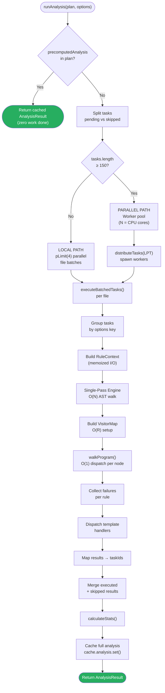

---

## 5. Execution Strategies

### 5.1 Strategy Selection

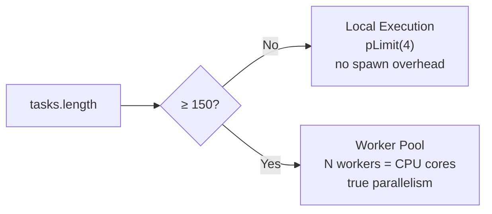

The threshold of **150 tasks** balances worker spawn overhead vs. parallelism gains.

### 5.2 Local Execution Path

```typescript
// orchestrator.ts
async function executeTasksLocally(tasks, rootDir) {
    const context     = createAnalysisContext(rootDir);   // memoized I/O
    const tasksByFile = groupTasksByFile(tasks);           // Map<path, Task[]>
    const limit       = pLimit(4);                        // max 4 concurrent files

    const results = await Promise.all(
        [...tasksByFile.values()].map(fileTasks =>
            limit(() => executeBatchedTasks(fileTasks, context))
        )
    );

    return results.flat();
}
```

### 5.3 Parallel Execution Path

```typescript
// worker-pool.ts
async function runAnalysisParallel(tasks, rootDir, startTime) {
    const workerCount = Math.max(2, os.cpus().length);
    const chunks      = distributeTasks(tasks, workerCount);  // LPT algorithm

    const promises = chunks.map(chunk =>
        new Promise((resolve, reject) => {
            const worker = new Worker(workerPath, {
                workerData: { rootDir, tasks: chunk }
            });
            worker.on("message", msg => resolve(msg.results));
            worker.on("error",   reject);
            worker.on("exit",    code => { if (code !== 0) reject(new Error(...)); });
        })
    );

    const chunkResults = await Promise.all(promises);
    return chunkResults.flat();
}
```

---

## 6. Worker Thread Architecture

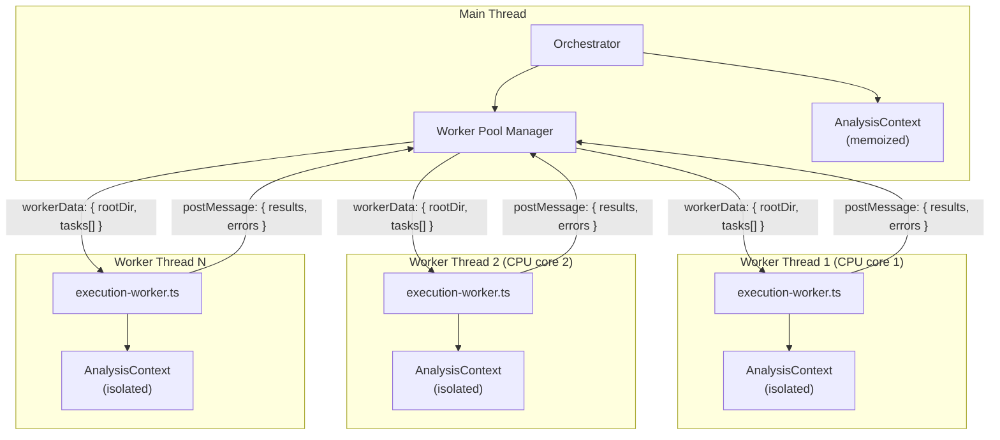

### Worker Entry Point (execution-worker.ts)

```typescript
// CRITICAL: Must import rules FIRST — registers all handlers
import './rules/register-all.js';

const { rootDir, tasks } = workerData;
const context            = createAnalysisContext(rootDir);
const tasksByFile        = groupTasksByFile(tasks);
const results: RuleResult[] = [];
const errors:  ErrorEntry[]  = [];

for (const fileTasks of tasksByFile.values()) {
    try {
        const batch = await executeBatchedTasks(fileTasks, context);
        results.push(...batch);
    } catch (e) {
        errors.push({ task: fileTasks[0], error: e.message });
    }
}

parentPort.postMessage({ results, errors });
```

### AnalysisContext (analysis-context.ts)

Per-run memoization layer — prevents redundant I/O within a single analysis run.

```typescript
interface ExecutionContext {
    readFile:    (path: string) => Promise<string>;
    getProgram:  (path: string) => Promise<oxc.Program>;
    getTemplate: (path: string) => Promise<HtmlParserResult>;
    getStyle:    (path: string) => Promise<CssResult>;
}

// Each worker has its own isolated AnalysisContext
// Results are NOT shared between workers (no shared memory)
```

---

## 7. Single-Pass Rule Engine

This is the most performance-critical component. All rules for a given file+options combination execute in **one** AST walk.

### 7.1 The Batching Strategy

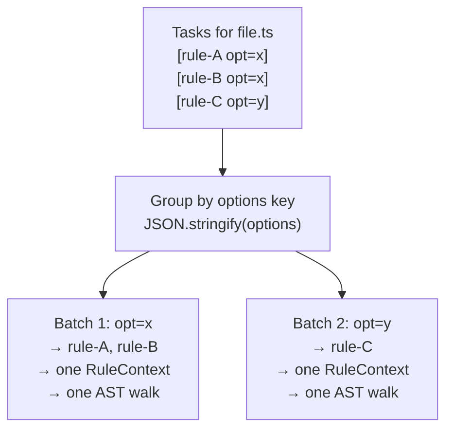

Tasks for the same file **and** same options share one `RuleContext` build and one traversal.

### 7.2 Visitor Registry — O(1) Dispatch

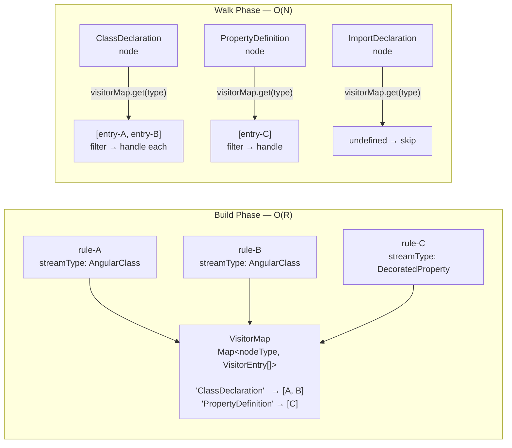

**Stream → Node Type mapping:**

| StreamType | AST Node Type | Phase |
|---|---|---|
| `AngularClass` | `ClassDeclaration` | During walk |
| `DecoratedProperty` | `PropertyDefinition` | During walk |
| `TemplateExpression` | `__template_expression__` | Post-walk |
| `TemplateAttribute` | `__template_attribute__` | Post-walk |

### 7.3 Node Streams (Pre-filtering)

Raw AST nodes are converted to **semantic stream nodes** before reaching rule handlers.

```typescript
// node-streams.ts

// Converts raw ClassDeclaration → AngularClassNode (or null)
function toAngularClassStream(classNode): AngularClassNode | null {
    const metadata = analyzeComponent(classNode);  // cached
    if (!metadata) return null;                    // skip non-Angular classes
    return { node: classNode, metadata };
}

// Converts raw PropertyDefinition → DecoratedPropertyNode (or null)
function toDecoratedPropertyStream(propertyNode): DecoratedPropertyNode | null {
    const decorators = propertyNode.decorators;
    if (!decorators?.length) return null;           // skip undecorated properties
    return { node: propertyNode, decorators };
}
```

Rules only receive **pre-filtered, semantically enriched** nodes — never raw AST nodes.

### 7.4 Single-Pass Engine Internals

```typescript
// single-pass-engine.ts
function runSinglePassAnalysis(rules, context) {
    // 1. Build dispatch map — O(R) where R = number of rules
    const visitorMap = buildVisitorMap(rules, streamFilters);

    // 2. Separate template-specific handlers (post-walk)
    const templateExprHandlers = rules.filter(r => r.streamType === 'TemplateExpression');
    const templateAttrHandlers = rules.filter(r => r.streamType === 'TemplateAttribute');

    // 3. Initialize per-rule failure buckets
    const failuresByRule = new Map(rules.map(r => [r.name, []]));

    // 4. Single AST traversal — O(N) where N = number of AST nodes
    walkProgram(context.program, (node) => {
        const visitors = visitorMap.get(node.type);   // O(1) lookup
        if (!visitors) return;                         // skip unknown types

        for (const entry of visitors) {
            const streamNode = entry.filter(node);     // raw → semantic
            if (!streamNode) continue;                 // filtered out
            const failure = entry.handle(streamNode, context);
            if (failure) failuresByRule.get(entry.ruleName).push(failure);
        }
    });

    // 5. Post-walk: template analysis
    if (context.template) {
        dispatchTemplateHandlers(context.template, templateExprHandlers, ...);
    }

    // 6. Collect results
    return rules.map(rule => ({
        ruleName: rule.name,
        failures: failuresByRule.get(rule.name) ?? []
    }));
}
```

### 7.5 Performance Budgets

```typescript
const BUDGET_MS_PER_FILE_WITHOUT_TYPES = 2;   // p95 — syntax-only rules
const BUDGET_MS_PER_FILE_WITH_TYPES    = 5;   // p95 — type-aware rules
```

Budget violations are tracked in `PerformanceReport.budgetViolations` and surfaced in CI.

---

## 8. Task Scheduling & Load Balancing

### 8.1 No Priority Queue

There is no traditional scheduler. Tasks are processed in this order:

1. **Group** by file path
2. **Sort** files by task count (descending) — for LPT worker distribution
3. **Within file:** group by options key (for batching)
4. **Execution order within batch:** Map iteration order

### 8.2 LPT Load Balancing (Worker Pool)

The **Longest Processing Time** greedy algorithm distributes files across workers to minimize total wall-clock time.

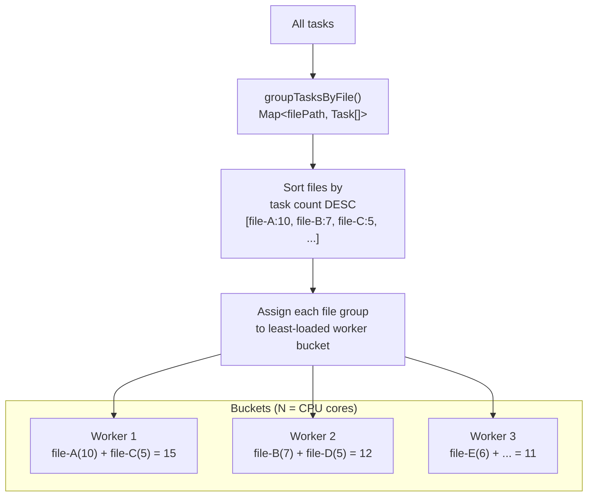

**Key property:** Files are never split across workers — all tasks for a file go to the same worker, preserving `AnalysisContext` memoization benefits.

### 8.3 Concurrency Summary

| Layer | Mechanism | Limit |
|---|---|---|
| File batching (local) | `pLimit(4)` | 4 concurrent files |
| Worker pool | `new Worker()` | `max(2, os.cpus())` |
| Cache bulk ops | Manual batching | 200 keys per batch |
| Hash warmup | `Promise.all()` | 500 files per batch |

---

## 9. Result Collection & Aggregation

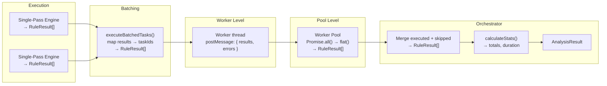

### Statistics Calculation (analysis-stats.ts)

```typescript
function calculateStats(results, startTime) {
    const failures    = results.flatMap(r => r.failures);
    const uniqueFiles = new Set(failures.map(f => f.filePath));

    return {
        totalFiles:    uniqueFiles.size,
        totalErrors:   failures.filter(f => f.severity === 'error').length,
        totalWarnings: failures.filter(f => f.severity === 'warning').length,
        duration:      performance.now() - startTime
    };
}
```

---

## 10. Error Handling & Recovery

The engine follows a **never-abort** philosophy — one bad file or rule should not crash the entire analysis.

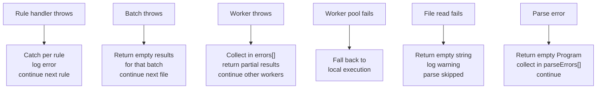

### Recovery Levels

| Level | Strategy | Effect |
|---|---|---|
| Rule handler | `try/catch` → log + continue | Skip one rule for one node |
| File batch | `try/catch` → empty results | Skip all rules for one file |
| Worker thread | `errors[]` accumulation | Partial results from that worker |
| Worker pool | Fallback to local | Full execution, no parallelism |
| File I/O | Empty string | File counted as empty |
| AST parse | Empty program | File produces no AST-based failures |

---

## 11. Cache Integration

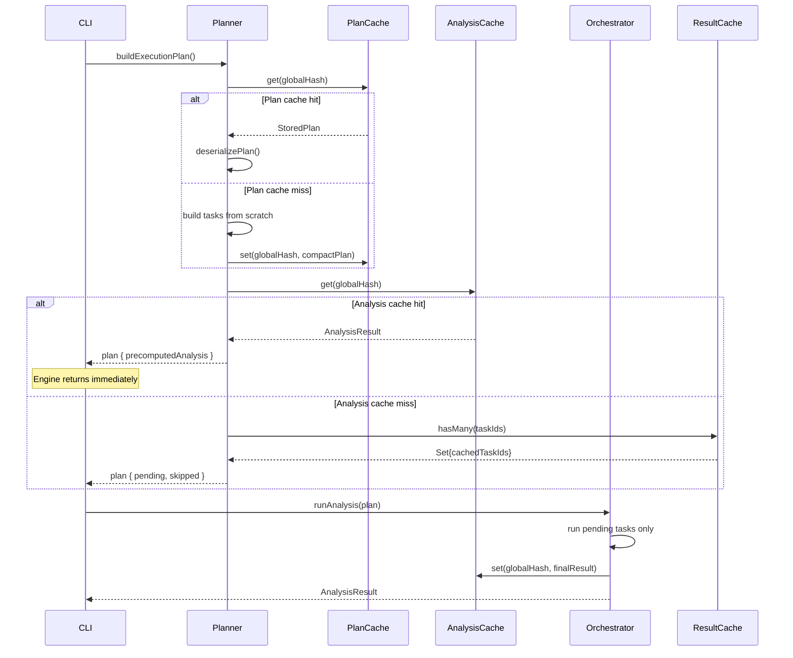

### Three Cache Short-Circuit Levels

| Level | Cache Used | When It Fires | Skip What |
|---|---|---|---|
| **L1 — Full Analysis** | `cache.analysis` | Global hash unchanged | Everything |
| **L2 — Plan** | `cache.plans` | Global hash unchanged | Task building |
| **L3 — Tasks** | `cache.results` | Per-task content hash unchanged | Individual rule execution |

### Hash Warmup (before plan building)

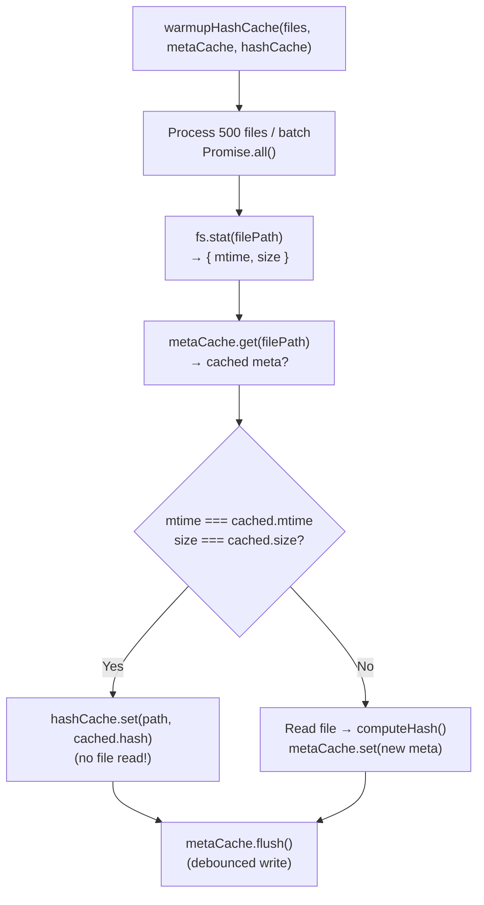

---

## 12. Configuration & Performance Budgets

### Analysis Options

```typescript
interface AnalysisOptions {
    rootDir:  string;          // root for file path resolution
    cache?:   CacheContext;    // enable caching (all levels)
    debug?:   boolean;         // verbose debug logging
}
```

### Execution Plan Options

```typescript
interface ExecutionPlanOptions {
    files:        ReadonlyArray<string>;
    rules:        ReadonlyMap<string, ResolvedRule>;
    rootDir:      string;
    cache?:       CacheContext;
    debug?:       boolean;
    incremental?: IncrementalFilterOptions;
}

interface IncrementalFilterOptions {
    forceRerun?:        boolean;   // bypass cache check entirely
    loadCachedResults?: boolean;   // pre-load results into plan
    maxCacheAge?:       number;    // max age ms before forced re-run
}
```

### Concurrency Constants

```typescript
const LOCAL_CONCURRENCY     = 4;      // pLimit value for file batches
const WORKER_THRESHOLD      = 150;    // tasks before spawning workers
const MIN_WORKERS           = 2;      // floor for worker count
const CACHE_BATCH_SIZE      = 200;    // hasMany / getMany batch
const META_BATCH_SIZE       = 100;    // metadata update batch
const WARMUP_BATCH_SIZE     = 500;    // files per hash warmup batch
const PLAN_PARALLEL_THRESH  = 10000; // files before parallelizing plan build
```

### Performance Budgets (CI enforced)

```typescript
const BUDGET_MS_WITHOUT_TYPES = 2;   // per file, syntax-only rules
const BUDGET_MS_WITH_TYPES    = 5;   // per file, type-aware rules
```

---

## 13. Data Flow Diagrams

### Complete Engine Data Flow

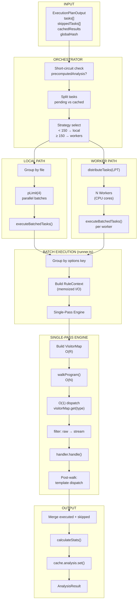

### Single-Pass Engine Internals

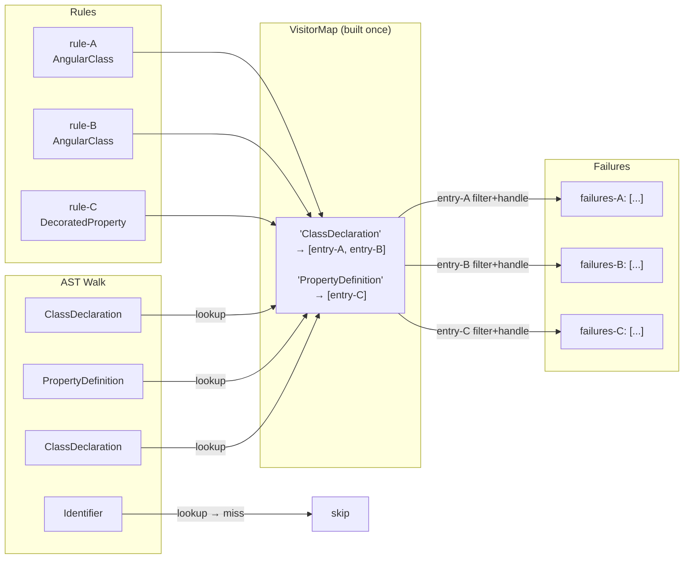

---

## 14. Integration Points

### Planner → Engine

```
buildExecutionPlan()
  └─ returns ExecutionPlanOutput
       └─ consumed by runAnalysis()
```

### Engine → Cache

```typescript
// Read (via plan at startup)
cache.results.hasMany(taskIds)       // which tasks to skip
cache.results.getMany(taskIds)       // load pre-cached results
cache.analysis.get(globalHash)       // full analysis short-circuit
cache.plans.get(globalHash)          // plan structure short-circuit

// Write (after execution)
cache.analysis.set(globalHash, result)   // store full analysis
cache.results.set(taskId, result)        // store individual results
```

### Engine → Rules

```typescript
registerNewEngineRule(handler)       // registration
executeBatchedNewEngineRules(names, context)  // execution
isNewEngineRule(name)               // routing check
```

### AnalysisContext → Parsers

```
readFile(path)     → string           (memoized per run)
getProgram(path)   → oxc.Program      (memoized per run)
getTemplate(path)  → HtmlParserResult (memoized per run)
getStyle(path)     → CssResult        (memoized per run)
```

---

## File Reference

| File | Role |
|---|---|
| `engine/orchestrator.ts` | Entry point: `runAnalysis()`, strategy selection, result aggregation |
| `engine/runner.ts` | `executeBatchedTasks()` — groups by options, builds context, calls engine |
| `engine/worker-pool.ts` | Spawns workers, LPT distribution, result collection |
| `engine/execution-worker.ts` | Worker thread entry: imports rules, groups by file, runs batches |
| `engine/analysis-context.ts` | Per-run memoized `readFile`, `getProgram`, `getTemplate` |
| `engine/analysis-stats.ts` | `calculateStats()` — totals, durations |
| `rules/engine/single-pass-engine.ts` | `runSinglePassAnalysis()` — O(N) walk + O(1) dispatch |
| `rules/engine/adapter.ts` | Registry bridge + `executeBatchedNewEngineRules()` |
| `rules/engine/rule-context-factory.ts` | `build()` — constructs `RuleContext` with memoized I/O |
| `rules/engine/visitor-registry.ts` | `buildVisitorMap()` — O(1) dispatch map |
| `rules/engine/node-streams.ts` | `toAngularClassStream`, `toDecoratedPropertyStream` |
| `planner/builder.ts` | `buildExecutionPlan()` — top-level orchestration |
| `planner/incremental.ts` | `filterCachedTasks()` — cache-based task filtering |
| `planner/task-builder.ts` | Task construction (rule × file cartesian product) |
| `planner/hashing.ts` | Task ID + global hash calculation |
| `planner/indexes.ts` | Pre-computed indexes for O(1) queries |
| `planner/serialize.ts` | Plan serialization / deserialization |
