# Planner Architecture — ngcompass

> Deep-dive documentation of the execution plan builder in the core package — covering file classification, task construction, hashing, indexes, serialization, incremental filtering, and worker parallelization.

---

## Table of Contents

1. [Overview](#1-overview)
2. [File Tree](#2-file-tree)
3. [Type Definitions](#3-type-definitions)
4. [Full Execution Lifecycle](#4-full-execution-lifecycle)
5. [File Discovery & Classification](#5-file-discovery--classification)
6. [Resource Discovery](#6-resource-discovery)
7. [Component Dependency Graph](#7-component-dependency-graph)
8. [Task Building](#8-task-building)
9. [Content Hashing](#9-content-hashing)
10. [Index Building](#10-index-building)
11. [Incremental Filtering](#11-incremental-filtering)
12. [Plan Serialization](#12-plan-serialization)
13. [Worker Parallelization](#13-worker-parallelization)
14. [Cache Integration](#14-cache-integration)
15. [Error Handling](#15-error-handling)
16. [Constants & Thresholds](#16-constants--thresholds)
17. [Data Flow Diagrams](#17-data-flow-diagrams)

---

## 1. Overview

The planner is the **preparation layer** between configuration and execution. It takes a list of files and a map of rules, and produces an `ExecutionPlanOutput` — a complete, indexed description of exactly what work needs to happen, with cache-aware filtering of tasks that can be skipped.

### Core Responsibilities

| Responsibility | Module |
|---|---|
| Classify files by Angular type | `file-type.ts` |
| Discover companion resources (template, styles, spec) | `resources.ts` |
| Build component dependency graph for O(1) lookups | `component-graph.ts` |
| Construct tasks (rule × file cartesian product) | `task-builder.ts` |
| Hash all content for cache keys | `hashing.ts` |
| Build query indexes over the plan | `indexes.ts` |
| Filter already-cached tasks | `incremental.ts` |
| Serialize/deserialize plans compactly | `serialize.ts` |
| Parallelize task building for large projects | `worker.ts` |
| Orchestrate all of the above | `builder.ts` |

### Performance Characteristics

| Run Type | Complexity | What Happens |
|---|---|---|
| **Cold** (no cache) | O(F × R) + hashing | Full task build |
| **Warm** (plan cached) | O(F) stat checks + O(T) filter | Deserialize + filter |
| **Hot** (analysis cached) | O(1) | Return stored result immediately |

---

## 2. File Tree

```
packages/core/src/planner/
│
├── builder.ts           ← buildExecutionPlan() — top-level orchestrator
├── types.ts             ← All type definitions (Task, Plan, Indexes, etc.)
├── task-builder.ts      ← Task construction (rule × file logic)
├── incremental.ts       ← Cache-based task filtering (Phase 2.0)
├── indexes.ts           ← Pre-computed index builder
├── hashing.ts           ← xxhash / SHA-256, warmup, task ID, global hash
├── resources.ts         ← Companion file discovery (template, styles, spec)
├── serialize.ts         ← CompactPlan serialization / deserialization
├── file-type.ts         ← Angular file type detection
├── component-graph.ts   ← Component dependency graph (O(1) resource lookup)
├── worker.ts            ← Worker thread entry point for parallel task building
└── index.ts             ← Public API exports
```

---

## 3. Type Definitions

### 3.1 Top-Level Output

```typescript
interface ExecutionPlanOutput {
    readonly tasks:                ReadonlyArray<Task>;             // pending tasks (to run)
    readonly plan:                 ExecutionPlan;                   // file-centric view
    readonly indexes:              ExecutionIndexes;                // pre-computed indexes
    readonly skippedTasks:         ReadonlyArray<Task>;            // cache hits (skip)
    readonly cachedResults?:       ReadonlyMap<string, unknown>;   // pre-loaded results
    readonly globalHash?:          string;                         // plan identity hash
    readonly precomputedAnalysis?: AnalysisResult;                 // full cache short-circuit
}

// File-centric view (legacy / backward-compat)
type ExecutionPlan = Readonly<Record<string, FileAnalysisUnit>>;
```

### 3.2 Task (Primary Unit of Work)

```typescript
// Task-Centric — Phase 1.75, content-addressed
interface Task {
    readonly taskId:   string;                           // hash(rule + inputs + options)
    readonly ruleName: string;
    readonly filePath: string;
    readonly severity: RuleSeverity;
    readonly options:  Readonly<Record<string, unknown>>;
    readonly inputs:   TaskInputs;
}

// File-Centric — legacy view (used in ExecutionPlan)
interface RuleTask {
    readonly ruleName: string;
    readonly severity: RuleSeverity;
    readonly options:  Readonly<Record<string, unknown>>;
    readonly cacheKey: string;
    readonly inputs:   TaskInputs;
}
```

### 3.3 Task Inputs

```typescript
interface TaskInputs {
    typescript: FileInput;
    template?:  FileInput;
    styles?:    ReadonlyArray<FileInput>;
    spec?:      FileInput;
}

interface FileInput {
    readonly path:     string;
    readonly hash:     string;    // content hash
    readonly needsAst: boolean;   // whether AST parsing is needed
}
```

### 3.4 Execution Indexes

```typescript
interface ExecutionIndexes {
    // Parsing optimization — which files need which parser
    readonly filesNeedingTsAst:       ReadonlyArray<string>;
    readonly filesNeedingHtmlAst:     ReadonlyArray<string>;
    readonly filesNeedingCssAst:      ReadonlyArray<string>;
    readonly filesNeedingTypeChecker: ReadonlyArray<string>;

    // Task grouping indexes
    readonly tasksByFile:             Readonly<Record<string, ReadonlyArray<Task>>>;
    readonly tasksByRule:             Readonly<Record<string, ReadonlyArray<string>>>;
    readonly tasksBySeverityLevel:    Readonly<Record<RuleSeverity, ReadonlyArray<Task>>>;
    readonly filesByType:             Readonly<Record<FileType, ReadonlyArray<string>>>;
    readonly tasksBySeverity:         Readonly<Record<RuleSeverity, number>>;

    readonly stats: ExecutionStats;
}

interface ExecutionStats {
    readonly totalFiles:         number;
    readonly totalTasks:         number;
    readonly avgTasksPerFile:    number;
    readonly filesWithTemplates: number;
    readonly filesWithStyles:    number;
    readonly filesWithSpecs:     number;
}
```

### 3.5 Incremental Types

```typescript
interface IncrementalPlan {
    readonly skippedTasks:   ReadonlyArray<Task>;
    readonly tasks:          ReadonlyArray<Task>;
    readonly cachedResults:  ReadonlyMap<string, unknown>;
    readonly stats:          CacheFilterStats;
}

interface CacheFilterStats {
    readonly totalTasks:          number;
    readonly cachedTasks:         number;
    readonly pendingTasks:        number;
    readonly cacheHitRate:        number;   // 0.0 → 1.0
    readonly timeSavedEstimate:   number;
}

interface IncrementalFilterOptions {
    readonly forceRerun?:        boolean;
    readonly loadCachedResults?: boolean;
    readonly maxCacheAge?:       number;    // ms
}
```

### 3.6 Builder Options

```typescript
interface ExecutionPlanOptions {
    readonly files:        ReadonlyArray<string>;
    readonly rules:        ReadonlyMap<string, ResolvedRule>;
    readonly rootDir:      string;
    readonly cache?:       CacheContext;
    readonly debug?:       boolean;
    readonly incremental?: IncrementalFilterOptions;
}
```

---

## 4. Full Execution Lifecycle

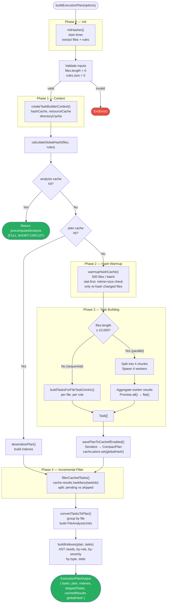

---

## 5. File Discovery & Classification

### Detection Algorithm (`file-type.ts`)

File type is determined by **filename suffix** (not content), in priority order:

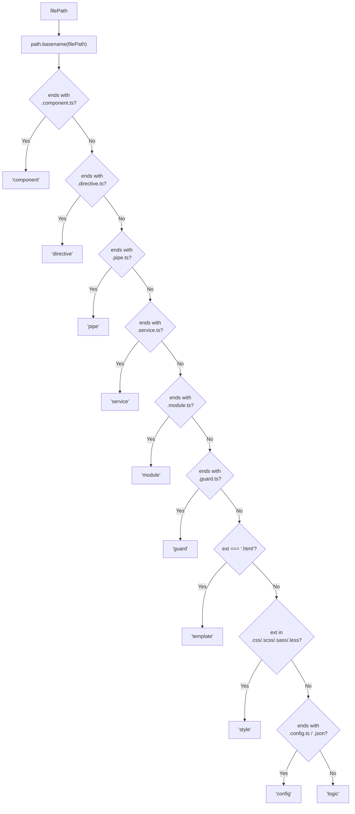

### Helper Predicates

```typescript
isTypeScriptFile(path)  → ext === '.ts' && !ext.endsWith('.d.ts')
isTemplateFile(path)    → ext === '.html'
isStyleFile(path)       → /\.(css|scss|sass|less)$/.test(ext)
isSpecFile(path)        → basename includes '.spec.'
isComponentFile(path)   → basename.endsWith('.component.ts')

// "user.component.ts"    → "user"
// "auth.service.spec.ts" → "auth.service"
getBaseName(path)       → strips suffix to base
```

---

## 6. Resource Discovery

Given a `.component.ts` file, the planner must find all companion files.

### Convention Mapping (`resources.ts`)

```
src/app/user.component.ts
├── Template:  user.component.html
├── Styles:    user.component.{css|scss|sass|less}  (all found)
└── Spec:      user.component.spec.ts  OR  user.spec.ts
```

### Algorithm

```typescript
async function discoverResources(tsFilePath, needsTs, needsHtml, needsCss, needsSpec, dirCache) {
    const dir      = path.dirname(tsFilePath);
    const baseName = getBaseName(tsFilePath);       // "user"

    // 1. List directory once (cached per dir)
    const files = await listDirectory(dir, dirCache);
    const fileSet = new Set(files);

    // 2. Find companions by convention
    const template = fileSet.has(`${baseName}.component.html`)
        ? buildFileInput(`${baseName}.component.html`, needsHtml)
        : undefined;

    const styles = STYLE_EXTENSIONS
        .filter(ext => fileSet.has(`${baseName}.component${ext}`))
        .map(ext => buildFileInput(`${baseName}.component${ext}`, needsCss));

    const spec = fileSet.has(`${baseName}.component.spec.ts`)
        ? buildFileInput(`${baseName}.component.spec.ts`, needsSpec)
        : fileSet.has(`${baseName}.spec.ts`)
            ? buildFileInput(`${baseName}.spec.ts`, needsSpec)
            : undefined;

    return { typescript: buildFileInput(tsFilePath, needsTs), template, styles, spec };
}
```

**Directory cache** ensures each directory is listed only once per plan build, regardless of how many components it contains.

---

## 7. Component Dependency Graph

The dependency graph is a one-time, O(N) pre-computation that turns all subsequent resource lookups from O(D) directory reads into O(1) map lookups.

### Structure

```typescript
interface ComponentNode {
    tsPath:       string;
    templatePath?: string;
    stylePaths:   string[];
    specPath?:    string;
    type:         FileType;
}

class ComponentDependencyGraph {
    private graph = new Map<string, ComponentNode>();
    build(files: ReadonlyArray<string>): void
    getResources(tsPath: string): ComponentNode | undefined
}
```

### Build Algorithm

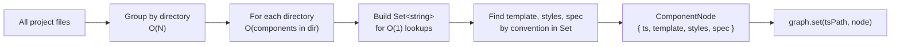

**Key property:** Files are never split across directories. Each directory is processed exactly once. The total work is O(N).

### Fast-Path vs Fallback

```typescript
// In task-builder.ts
if (context?.componentGraph) {
    const node = context.componentGraph.getResources(filePath);
    if (node) {
        context.graphStats.hits++;           // O(1) path
        return convertNodeToTaskInputs(node);
    }
    context.graphStats.misses++;
}
// Fallback: directory scan (O(D))
return await discoverResources(filePath, ...);
```

---

## 8. Task Building

### Rule Applicability Matrix (`task-builder.ts`)

A rule is only applied to files where it makes semantic sense:

| Dependency Type | component | directive | pipe | service | module | guard | logic | template | style | config |
|---|:---:|:---:|:---:|:---:|:---:|:---:|:---:|:---:|:---:|:---:|
| `standalone` | ✓ | ✓ | ✓ | ✓ | ✓ | ✓ | ✓ | ✗ | ✗ | ✗ |
| `imports` | ✓ | ✓ | ✓ | ✓ | ✓ | ✓ | ✓ | ✗ | ✗ | ✗ |
| `component` | ✓ | ✓ | ✗ | ✗ | ✗ | ✗ | ✗ | ✗ | ✗ | ✗ |
| `styles` | ✓ | ✗ | ✗ | ✗ | ✗ | ✗ | ✗ | ✗ | ✗ | ✗ |
| `off` | ✗ | ✗ | ✗ | ✗ | ✗ | ✗ | ✗ | ✗ | ✗ | ✗ |

### Single Task Build Flow

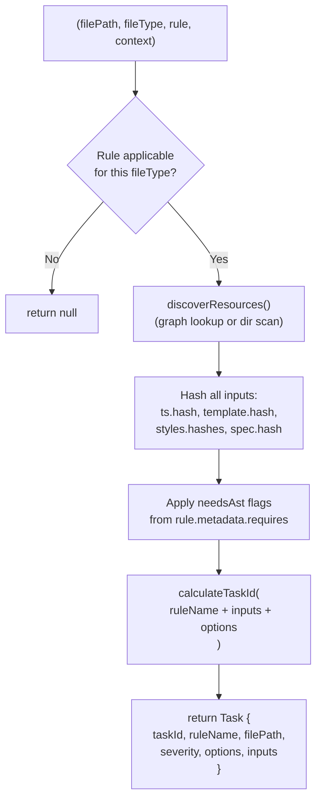

### Task ID Formula

```
taskId = hash(
    ruleName         +
    typescript.path  +   ← included for uniqueness across files
    typescript.hash  +   ← content hash
    template.hash    +   ← if present
    sort(styles.hashes).join("::") +   ← stable ordering
    spec.hash        +   ← if present
    stableJSON(options)  ← deterministic serialization
)
```

**Content-based:** renaming a file produces the same `taskId` if content is unchanged.

### Cartesian Product Optimization

Naive approach: O(F × R) where every file gets every rule.
Optimized approach:

```
1. Group rules by dependencyType → O(R)
2. For each file:
   a. Detect fileType                      → O(1) per file
   b. Select applicable rule subset        → O(1) lookup
   c. Build tasks only for applicable rules → O(R_applicable)

Net: O(F × R_applicable)  where R_applicable << R
```

---

## 9. Content Hashing

### Hash Function Selection

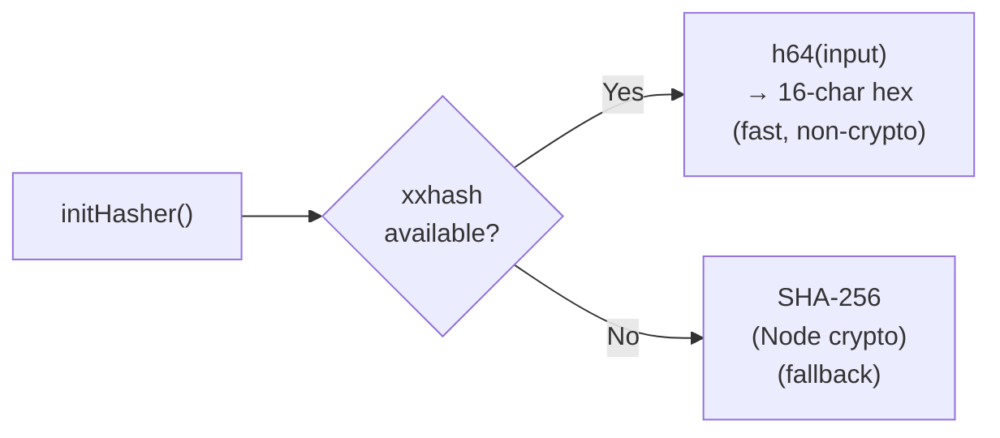

xxhash is preferred for speed. SHA-256 is cryptographically secure but slower. For cache keys, non-cryptographic is acceptable.

### Three-Level Hash Caching

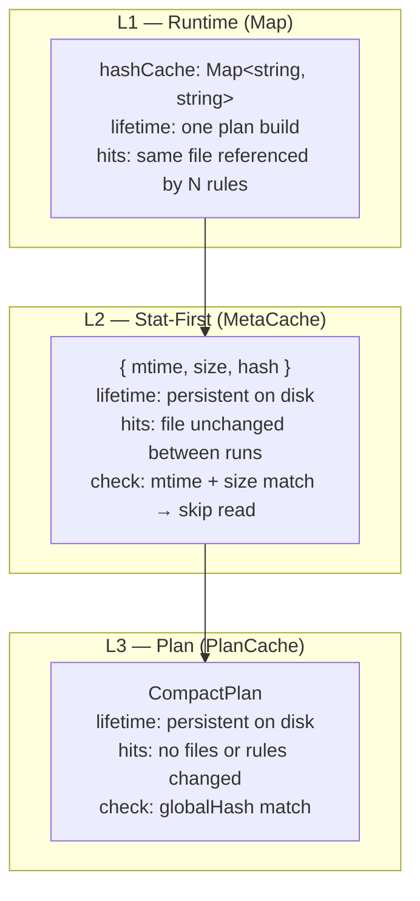

### Hash Warmup (Stat-First Strategy)

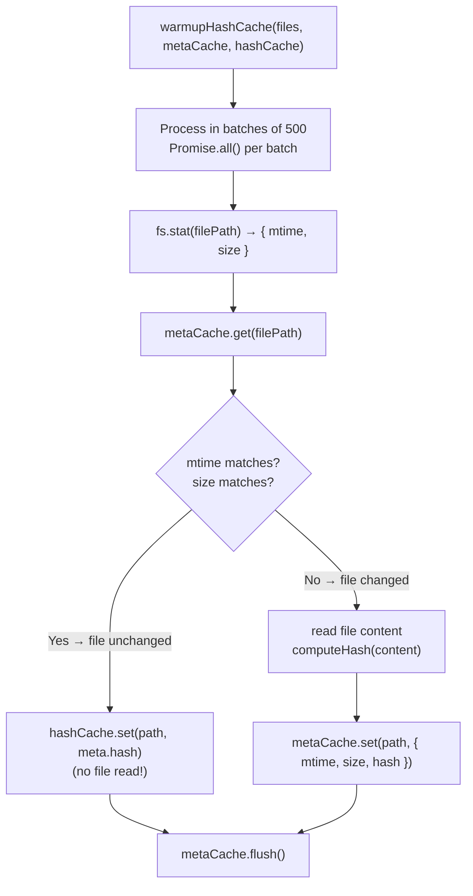

### Global Hash

Uniquely identifies the entire project state (all files + all rules):

```
globalHash = hash(
    sort( "file1.ts:hash1", "file2.ts:hash2", ... )  ← deterministic ordering
    + "||"
    + hash( all rule configs )
)
```

Any file change or rule config change → new `globalHash` → plan cache miss.

---

## 10. Index Building

Indexes are pre-computed at plan build time so the engine can make O(1) queries at runtime.

### Index Types (`indexes.ts`)

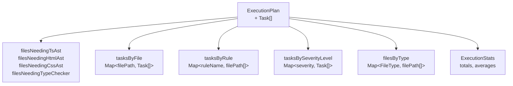

### Files Needing AST

```typescript
// Determined by scanning task.inputs.*.needsAst flags
filesNeedingTsAst   = files where any task has typescript.needsAst === true
filesNeedingHtmlAst = files where any task has template?.needsAst === true
filesNeedingCssAst  = files where any task has styles?.some(s => s.needsAst)
```

The engine uses these lists to know **which parsers to warm up** before execution begins.

### Sort Guarantees

All index arrays are **sorted** before being frozen — ensuring deterministic output and enabling binary search if needed.

---

## 11. Incremental Filtering

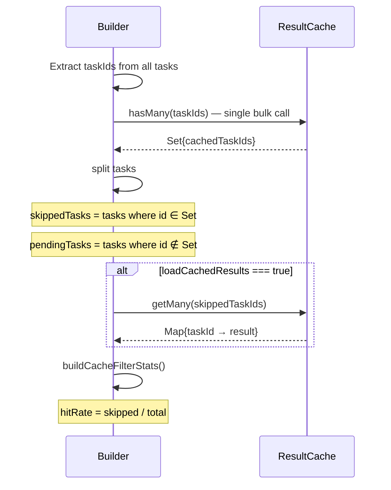

### Force Rerun

```typescript
if (options.forceRerun) {
    return {
        skippedTasks: [],
        tasks: allTasks,         // everything runs
        cachedResults: new Map(),
        stats: { cacheHitRate: 0, ... }
    };
}
```

### Cache Pruning

```typescript
pruneStaleCache(taskIds, cache, { maxAge?, maxEntries?, minHits? })
```

Stale criteria (entry pruned if **either** is true):

| Criterion | Default | Check |
|---|---|---|
| Too old | 7 days | `now - timestamp > maxAge` |
| Too cold | 1 hit | `hits < minHits` |

---

## 12. Plan Serialization

The planner uses **string interning** to produce a compact binary-like representation that avoids repeating identical strings.

### CompactPlan Format

```typescript
interface CompactPlan {
    v: number;     // version = 1
    r: string[];   // interned rule names
    o: any[];      // interned options objects
    f: string[];   // interned file paths
    h: string[];   // interned hash strings
    t: any[];      // unit tuples (indexes into r/o/f/h)
}
```

### Unit Tuple Layout

```
unit:  [ fileId, fileType, fileHashId, [ task1, task2, ... ] ]
task:  [ ruleId, severity, optId, cacheKeyId, tsInput, tplInput?, stylesInputs?, specInput? ]
input: [ fileId, hashId, needsAst ]
```

### String Interner

```typescript
class StringInterner {
    id(value: string): number  // returns existing index or assigns new one
    values(): string[]         // the interned table
}
```

**Effect on repeated strings:**

```
Before:  100 tasks × "no-lifecycle-hooks" rule name = 100 copies in JSON
After:   "no-lifecycle-hooks" stored once at index 3 → all tasks use integer 3
```

**Typical compression:** 60–70% size reduction for large plans.

### Serialization Flow

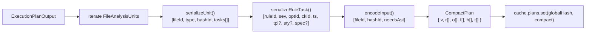

### Deserialization Flow

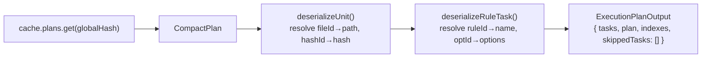

---

## 13. Worker Parallelization

### Threshold

| File Count | Strategy | Workers |
|---|---|---|
| `< 10,000` | Sequential in main thread | — |
| `≥ 10,000` | 4 worker threads | 4 |

### Worker Distribution

Files are split into **4 equal chunks** (round-robin) and each chunk is processed by one worker thread.

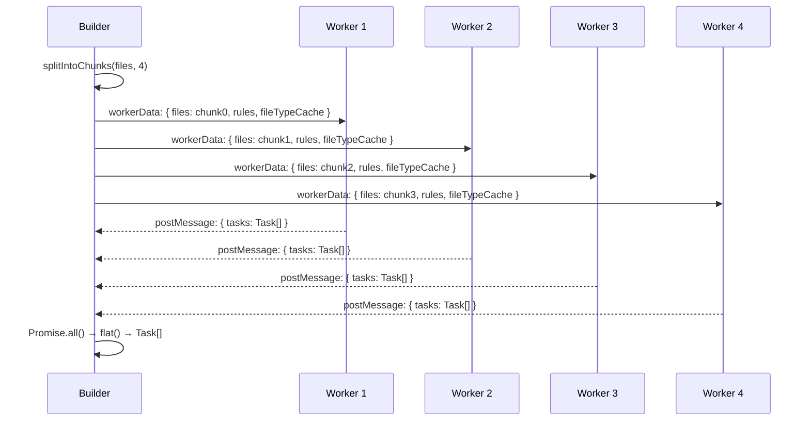

### Worker Entry Point (`worker.ts`)

```typescript
// worker.ts
const { files, rules, fileTypeCache } = workerData;

await initHasher();   // each worker initializes its own hasher

const context = {
    hashCache:     new Map<string, string>(),
    resourceCache: new Map<string, TaskInputs>(),
};

const tasks = await buildTasksForFiles(files, rules, fileTypeCache, context);

parentPort.postMessage({ tasks });
```

**Important:** Each worker has **isolated state** — no shared memory between workers. The `fileTypeCache` is passed as data (serialized), not a reference.

### Fallback

If any worker crashes, the builder catches the error and **falls back to sequential** execution:

```typescript
const result = await tryBuildAllTasksParallel(...);
if (result === null) {
    // Worker path failed — sequential fallback
    return buildAllTasksSequential(...);
}
```

---

## 14. Cache Integration

### Read/Write Map

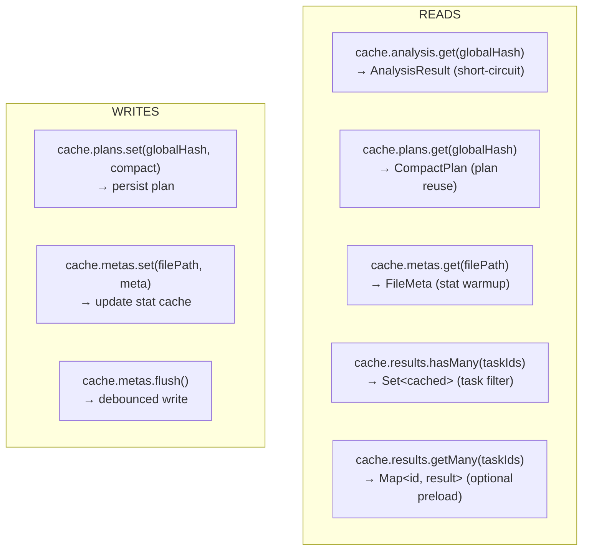

### Cache Key Summary

| Cache | Key | Value | Written By |
|---|---|---|---|
| `analysis` | `globalHash` | Full `AnalysisResult` | Orchestrator (not planner) |
| `plans` | `globalHash` | `CompactPlan` | Planner (`builder.ts`) |
| `metas` | `filePath` | `{ mtime, size, hash }` | Planner (`hashing.ts`) |
| `results` | `taskId` | Rule result | Engine (not planner) |

### Three Short-Circuit Levels

```
cache.analysis.get(globalHash)  → hit → return immediately (skip everything)
       ↓ miss
cache.plans.get(globalHash)     → hit → deserialize + filter only (skip task build)
       ↓ miss
cache.results.hasMany(taskIds)  → partial hits → skip individual tasks
```

---

## 15. Error Handling

### Result Type

```typescript
type Result<T, E = Error> =
    | { ok: true;  data:  T }
    | { ok: false; error: E }

// Usage
const result = await buildExecutionPlan(options);
if (!result.ok) {
    console.error(result.error.message);
    return;
}
const plan = result.data;
```

### Error Recovery Table

| Failure | Strategy | Effect |
|---|---|---|
| Empty file list | `Err(validation)` | Abort plan build |
| Empty rules | `Err(validation)` | Abort plan build |
| File read fails | Empty hash `""` | Task included, will execute |
| Directory list fails | Empty array `[]` | No companions found for file |
| Worker crashes | Fall back to sequential | Full plan built, no parallelism |
| Cache read fails | Treat as miss | Cold path taken |
| Serialization error | `"[Circular]"` in options | Task included with sanitized options |

---

## 16. Constants & Thresholds

```typescript
// Task building
const PARALLEL_THRESHOLD   = 10_000;  // files — above this, use workers
const WORKER_COUNT         = 4;       // fixed worker pool size

// Hash warmup
const WARMUP_BATCH_SIZE    = 500;     // files processed per Promise.all()

// Style file extensions
const STYLE_EXTENSIONS     = [".css", ".scss", ".sass", ".less"];

// Cache pruning defaults
const DEFAULT_MAX_AGE_MS   = 7 * 24 * 60 * 60 * 1000;  // 7 days
const DEFAULT_MIN_HITS     = 1;

// Serialization
const COMPACT_PLAN_VERSION = 1;
```

---

## 17. Data Flow Diagrams

### Complete Planner Data Flow

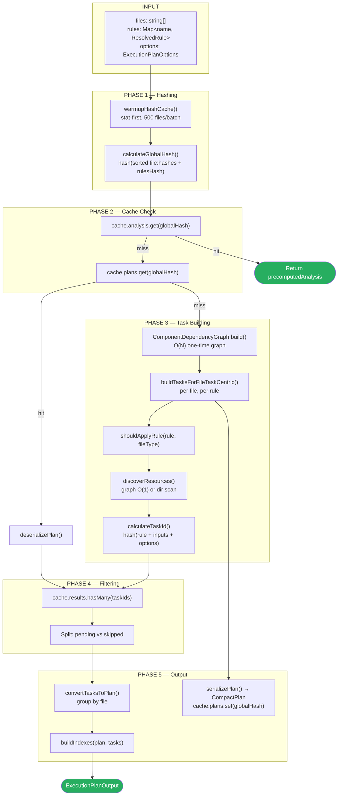

### Task ID Anatomy

```mermaid
graph LR
    RN["ruleName\n'check-lifecycle'"]
    TP["ts.path\n'user.component.ts'"]
    TH["ts.hash\n'a1b2c3d4...'"]
    TMP["template.hash\n'e5f6g7h8...'"]
    STY["styles.hashes\nsorted + joined"]
    SP["spec.hash\n'i9j0k1l2...'"]
    OPT["stableJSON(options)\n'{\"strict\":true}'"]

    RN --> CONCAT["join('::')"]
    TP --> CONCAT
    TH --> CONCAT
    TMP --> CONCAT
    STY --> CONCAT
    SP --> CONCAT
    OPT --> CONCAT
    CONCAT --> HASH["computeHash() → taskId\n'f3a9b2c1...'"]
```

### Global Hash Anatomy

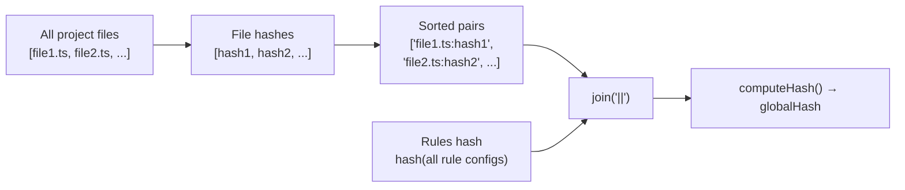

---

## File Reference

| File | Primary Export | Role |
|---|---|---|
| `builder.ts` | `buildExecutionPlan()` | Top-level orchestrator |
| `types.ts` | All interfaces | Type definitions |
| `task-builder.ts` | `buildTasksForFileTaskCentric()` | Task construction |
| `incremental.ts` | `filterCachedTasks()` | Cache-aware task filtering |
| `indexes.ts` | `buildIndexes()` | Query index builder |
| `hashing.ts` | `calculateTaskId()`, `calculateGlobalHash()`, `warmupHashCache()` | All hashing logic |
| `resources.ts` | `discoverResources()` | Companion file discovery |
| `serialize.ts` | `serializePlan()`, `deserializePlan()` | CompactPlan I/O |
| `file-type.ts` | `detectFileType()` | Angular file classification |
| `component-graph.ts` | `ComponentDependencyGraph` | O(1) resource lookup |
| `worker.ts` | Worker entry point | Parallel task building |
| `index.ts` | Re-exports | Public API surface |
