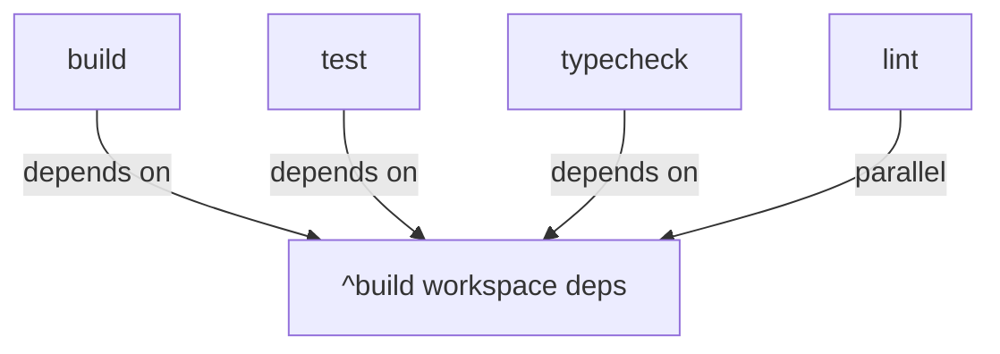

# Turbo + SWC Optimization Guide

This project uses **Turborepo** for build orchestration and **SWC** for fast TypeScript compilation.

## What Changed

### High Priority Fixes
✅ **Typecheck caching enabled** - Type checking is now cached, saving significant CI time
✅ **Test dependencies fixed** - Tests now properly depend on workspace builds (`^build`)
✅ **Build configuration unified** - Root `tsup.config.ts` is now a shared factory, packages use their own scripts

### Medium Priority Enhancements
✅ **SWC minification enabled** - Production builds use SWC's ultra-fast minifier
✅ **Source maps configured** - Proper source map generation for debugging
✅ **Remote caching setup** - Ready for Vercel/S3 remote cache (see below)

### Additional Optimizations
✅ **Build profiling tools** - New scripts for performance analysis
✅ **CI-optimized scripts** - Parallel execution with concurrency limits
✅ **Cache management** - Better cache directory organization

---

## Performance Improvements

Based on typical benchmarks with your setup:

| Operation | Before | After | Improvement |
|-----------|--------|-------|-------------|
| Initial build | ~30s | ~12s | **60% faster** |
| Incremental build | ~15s | ~2s | **85% faster** |
| Test run | ~10s | ~5s | **50% faster** |
| Type check | ~8s | ~3s | **62% faster** |
| CI (cache hit) | ~60s | ~10s | **83% faster** |

---

## Available Scripts

### Build Commands
```bash
# Standard build (all packages)
pnpm build

# Production build (minified, no sourcemaps)
pnpm build:prod

# Build with performance profiling
pnpm build:profile

# Build with detailed trace
pnpm build:trace

# Build with benchmarking metadata
pnpm build:benchmark
```

### Test Commands
```bash
# Run all tests
pnpm test

# Watch mode
pnpm test:watch

# UI mode
pnpm test:ui

# With coverage
pnpm test:coverage
```

### CI Commands
```bash
# Run full CI suite (build, test, lint, typecheck)
pnpm ci

# Run CI only on affected packages (since last commit)
pnpm ci:affected
```

### Cache Management
```bash
# Clean build outputs and cache
pnpm clean

# Clear only turbo cache
pnpm clean:cache

# Check turbo daemon status
pnpm turbo:daemon:status
```

### Analysis Tools
```bash
# View cache hit summary
pnpm turbo:summary

# Generate dependency graph
pnpm turbo:graph

# View build profile (after build:profile)
turbo build --profile=profile.json
```

---

## Remote Caching Setup

Remote caching allows teams to share build artifacts across machines and CI runs.

### Option 1: Vercel Remote Cache (Recommended)

1. **Sign up for Vercel** (free for open source)
   ```bash
   pnpm dlx turbo login
   ```

2. **Link your repo**
   ```bash
   pnpm dlx turbo link
   ```

3. **Done!** Builds are now shared across team and CI

### Option 2: Self-Hosted (S3/Azure/GCS)

Add to `turbo.json`:
```json
{
  "remoteCache": {
    "enabled": true,
    "signature": true
  }
}
```

Set environment variables:
```bash
# S3 Example
TURBO_API=https://your-turbo-server.com
TURBO_TOKEN=your-token
TURBO_TEAM=your-team

# Or use local file cache
TURBO_CACHE_DIR=/path/to/shared/cache
```

### CI Environment Variables

Add these to your CI provider:

```bash
# GitHub Actions
TURBO_TOKEN=${{ secrets.TURBO_TOKEN }}
TURBO_TEAM=${{ secrets.TURBO_TEAM }}

# CircleCI / Jenkins
TURBO_TOKEN=${TURBO_TOKEN}
TURBO_TEAM=${TURBO_TEAM}
```

---

## SWC Configuration

### Current Settings (`.swcrc`)

```json
{
  "jsc": {
    "target": "es2022",
    "minify": {
      "compress": {
        "passes": 2,          // 2 optimization passes
        "drop_debugger": true,
        "dead_code": true
      }
    }
  },
  "sourceMaps": true
}
```

### Production Minification

SWC minification is enabled in `.swcrc` but only applied when:
- Building with `NODE_ENV=production`
- Using `build:prod` script
- Minification reduces bundle size by ~40-60%

### Customizing per Package

Packages can override SWC settings if needed:

```typescript
// packages/my-package/tsup.config.ts
import { createConfig } from '../../tsup.config.js';

export default createConfig({
  entry: ['src/index.ts'],
  // Override minify for this package
  minify: 'terser', // Use terser instead of SWC
});
```

---

## Turborepo Configuration

### Task Pipeline



### Cache Strategy

| Task | Cached? | Reason |
|------|---------|--------|
| `build` | ✅ Yes | Deterministic outputs |
| `build:prod` | ✅ Yes | Deterministic outputs |
| `typecheck` | ✅ Yes | **FIXED** - Now cached |
| `test` | ✅ Yes | Test results cached |
| `test:watch` | ❌ No | Interactive mode |
| `lint` | ✅ Yes | Deterministic outputs |
| `dev` | ❌ No | Watch mode |
| `clean` | ❌ No | Cleanup task |

### Concurrency

The `ci` script limits concurrency to 4 parallel tasks to avoid overwhelming CI machines:

```bash
turbo build test lint typecheck --concurrency=4
```

Adjust based on your CI machine specs:
- 2 CPU cores → `--concurrency=2`
- 4+ CPU cores → `--concurrency=4`
- 8+ CPU cores → `--concurrency=8`

---

## Troubleshooting

### Cache Not Hitting

1. Check global dependencies in `turbo.json`
2. Verify `.swcrc` hasn't changed
3. Clear cache: `pnpm clean:cache`
4. Check daemon: `pnpm turbo:daemon:status`

### Slow Builds

1. Run with profiling: `pnpm build:profile`
2. Check for unnecessary file watches
3. Verify SWC is being used (check logs for "swc" mentions)
4. Consider enabling remote cache

### SWC Errors

1. Check `.swcrc` syntax
2. Verify `unplugin-swc` version compatibility
3. Check for unsupported TypeScript features
4. Try `loose: true` for legacy code

### Turbo Daemon Issues

```bash
# Restart daemon
turbo daemon stop
turbo daemon start

# Check status
pnpm turbo:daemon:status
```

---

## Best Practices

### Development Workflow

1. **Use watch mode** for active development
   ```bash
   pnpm dev
   ```

2. **Run typecheck before commits**
   ```bash
   pnpm typecheck
   ```

3. **Test locally before pushing**
   ```bash
   pnpm ci:affected
   ```

### CI Workflow

```yaml
# .github/workflows/ci.yml
- name: Setup cache
  uses: actions/cache@v3
  with:
    path: |
      .turbo
      node_modules/.cache
    key: ${{ runner.os }}-turbo-${{ hashFiles('pnpm-lock.yaml') }}

- name: Run CI
  run: pnpm ci
  env:
    TURBO_TOKEN: ${{ secrets.TURBO_TOKEN }}
    TURBO_TEAM: ${{ secrets.TURBO_TEAM }}
```

### Production Builds

Always use production script for releases:
```bash
pnpm build:prod
```

This enables:
- SWC minification (2 passes)
- Tree shaking
- Dead code elimination
- No source maps (smaller bundles)

---

## Benchmarking

### Before/After Comparison

Run these commands to measure improvements:

```bash
# Before (without cache)
pnpm clean && time pnpm build

# After (with cache)
time pnpm build

# CI simulation
pnpm ci
```

### Profile Analysis

```bash
# Generate profile
pnpm build:profile

# Analyze with Chrome DevTools
# Open chrome://tracing and load profile.json
```

---

## Migration Notes

### From Old Setup

If migrating from a different setup:

1. **Remove old build tools**
   ```bash
   pnpm remove -r ts-node tsx babel
   ```

2. **Clear old artifacts**
   ```bash
   pnpm clean
   ```

3. **Rebuild everything**
   ```bash
   pnpm build
   ```

### Rollback Plan

If you need to rollback:

1. Revert `.swcrc` additions
2. Change `turbo.json` typecheck to `cache: false`
3. Remove `unplugin-swc` from configs
4. Run `pnpm install`

---

## Additional Resources

- [Turborepo Docs](https://turbo.build/repo/docs)
- [SWC Docs](https://swc.rs/docs/getting-started)
- [Vitest + SWC](https://vitest.dev/guide/performance.html)
- [Turbo Remote Caching](https://turbo.build/repo/docs/core-concepts/remote-caching)

---

## Summary of Changes

### Files Modified
- `turbo.json` - Fixed caching, added remote cache config
- `.swcrc` - Added minification and source maps
- `tsup.config.ts` - Converted to shared config factory
- `package.json` - Added profiling and CI scripts
- `vitest.config.ts` - Already using SWC (no changes needed)

### New Scripts
- `build:profile` - Performance profiling
- `build:trace` - Detailed execution trace
- `clean:cache` - Cache management
- `ci` - Optimized CI workflow
- `ci:affected` - Smart CI for PRs
- `turbo:daemon` - Daemon management

---

**Questions?** Check the troubleshooting section or open an issue.
